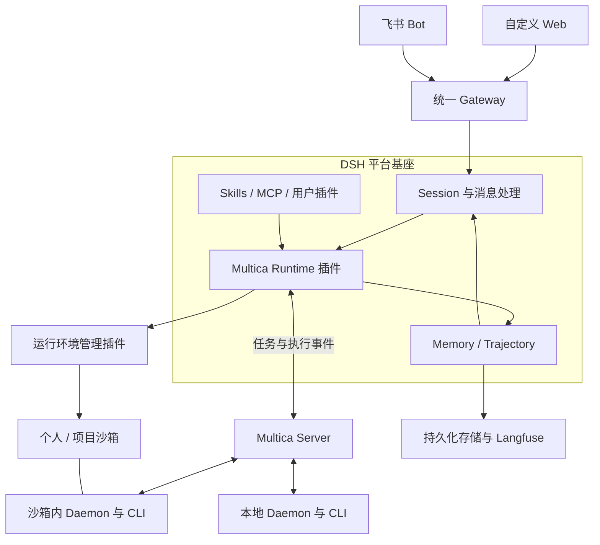

# 企业 Agent 中台技术方案

2026-09-12 · 面向约 200 名员工 · 概念设计

**方案确定为：DSH 作为平台主基座，自研 Multica Runtime 插件，复用 Multica Server/Daemon 调度不同 CLI；沙箱作为独立的运行环境管理。**

核心接入接口已核实，整体仍需开发适配插件并完成联调。本文描述目标架构，不代表现成组件已经完成整体集成。

## 1. 整体架构与技术选型

| 层次 | 职责 | 技术选型 | 实现方式 |
|---|---|---|---|
| 用户入口 | 聊天、文件、Runtime 与环境选择 | 自定义 Web、飞书 Bot | Web 基于 DSH Web 扩展；复用现有飞书接入 |
| 统一网关 | 登录、用户映射、消息去重、群聊路由、流式回复 | 现有 Gateway、Keycloak | 复用基础设施，补业务适配 |
| DSH 基座 | 插件、Skills、MCP、Memory、Session 管理 | DSH Profile 与插件体系 | 复用，补企业权限和管理插件 |
| Runtime 适配 | 将 DSH Agent 请求转成 Multica 任务 | 自研 DSH–Multica 插件 | 核心自研部分 |
| 执行调度 | 机器注册、任务排队、CLI 调用、结果上报 | Multica Server / Daemon | 优先原样复用 |
| 运行环境 | 个人、项目共享、临时或持久沙箱、本地电脑 | CubeSandbox、现有 VM、本地环境 | 复用产品，补生命周期适配 |
| 数据与评测 | 会话持久化、文件、Trajectory、质量评测 | DSH 持久化接口、PostgreSQL、S3 兼容存储、Langfuse | 复用存储与评测产品，补事件接入 |

DSH 是逻辑上的最大基座。Multica 插件安装在 DSH 内，Multica Server、Daemon 则作为独立进程部署。

## 2. Multica Runtime 插件

在平台 Profile 中，用自研插件替换默认 `dsh-agent-loop`，实现 DSH 的 `AgentFactory` 和 `Agent` 接口。源码已经提供这个替换点。[DSH Agent 接口](https://github.com/deepseek-ai/deepseek-harness/blob/master/packages/core/agent/src/index.ts)

插件承担六件事：

1. 保存 DSH Session 与 Multica Agent、Session、Task 的对应关系。
2. 按当前会话选择 Runtime、目标机器和工作目录。
3. 同步所选 Skills、MCP 配置及必要上下文。
4. 提交任务，处理流式输出、取消、恢复和错误。
5. 将执行事件写回 DSH，供聊天、Memory、Trajectory 使用。
6. 处理事件去重、断线对账和任务提交状态不明的情况。

**Runtime 选择按会话生效**，不能通过修改全局 Factory 或大家共用的 Multica Agent 配置来切换，避免影响其他用户。

选择 Codex，就是 Codex 执行主循环；选择 Claude Code，就是 Claude CLI 执行主循环。选择 DSH 时，目标端使用启用原生 Agent Loop 的独立 Profile，避免再次进入 Multica 插件形成递归。[Multica 后端能力](https://multica.ai/docs/providers)

## 3. 企业能力与用户插件

企业能力统一在 DSH 管理，但按能力类型进行适配。

| 能力类型 | 接入方式 | 切换 Runtime 后的行为 |
|---|---|---|
| Jira、Confluence、飞书等 Skill | 保留现有脚本和 `SKILL.md`，登记版本、依赖和权限 | 插件同步给 Multica，再由其注入 CLI |
| MCP 服务 | DSH 管理配置，按用户授权生成运行配置 | 分发给支持该 MCP 接入方式的后端 |
| DSH 普通工具插件 | 在 DSH 中安装 | 如需其他 CLI 调用，增加 MCP 或命令行接口 |
| DSH UI、Memory、Hook 插件 | 在对应 DSH 宿主中安装 | 依赖原生模型循环的部分需要单独适配 |

Multica 已实现各 CLI 的 Skill 目录注入，可以复用；但当前 Pi 后端不读取 Multica 管理的 MCP 配置，不能把所有 Runtime 的能力标成完全一致。[支持矩阵](https://multica.ai/docs/providers)

用户可以安装符合平台兼容要求的自定义插件。**用户插件按个人或项目隔离加载**，公共网关与管理服务只运行受信任的平台插件；安装能力不等于允许任意插件进入所有用户共用的进程。

## 4. 会话内切换 Runtime 与运行环境

用户界面把 Runtime 和运行环境分成两个选择，并展示工作目录及可用能力。

- Runtime：DSH、Codex、Claude Code、Pi。
- 运行环境：我的云端沙箱、项目共享沙箱、我的电脑。
- 工作目录：当前环境中的具体目录。
- 能力：本次可用的 Skills、MCP。

同一聊天切换时，保留 DSH Session，在当前任务完成或确认取消后，创建新的执行段，将历史摘要、必要消息、文件或 Git 变更交给目标 Runtime。

这里实现的是**同一会话连续工作**。不同 CLI 的内部会话状态不通用；跨机器文件也需要明确同步。Multica 的原生会话恢复依赖原会话仍存在且目标机器能够访问。[会话恢复说明](https://multica.ai/docs/providers)

切到个人电脑，需要运行 **Multica Daemon＋对应 CLI**，并准备认证和工作目录。Daemon 负责连接和执行，操作系统或沙箱负责隔离。[Daemon 机制](https://multica.ai/docs/daemon-runtimes)

## 5. 沙箱与持久化恢复

沙箱归属与生命周期独立设计，避免固定成“一人一个永久容器”。

| 类型 | 归属 | 生命周期 | 典型用途 |
|---|---|---|---|
| 个人临时沙箱 | 用户 | 任务结束后回收 | 一次性分析、文件处理 |
| 个人持久沙箱 | 用户 | 保存数据，空闲暂停 | 长期个人助手、开发环境 |
| 项目共享沙箱 | 项目成员 | 持续保存，统一管理 | 多人协作开发、共享资料 |
| 本地运行环境 | 用户或明确授权的成员 | 随电脑在线状态变化 | 操作本地代码、文件和工具 |

共享沙箱中，会话、任务身份和凭据仍然分开。修改同一工作目录的任务默认串行；需要并行开发时，使用独立目录或 Git worktree。暂停沙箱前检查全部活跃任务。

### 云端选型

结合暂停恢复要求，**云端沙箱优先选择腾讯 CubeSandbox**：它提供 MicroVM、内存与磁盘快照，以及暂停恢复能力，更贴近“环境暂停后继续工作”。部署前需要具备其支持的 Linux 虚拟化环境。[项目说明](https://github.com/TencentCloud/CubeSandbox)、[快照实现](https://github.com/TencentCloud/CubeSandbox/blob/master/docs/changelog/v0.3.0.md)

**OpenSandbox 保留为容器方案备选**：如果公司更适合 Docker/Kubernetes，且主要要求恢复文件与会话，可以选它；其 Docker/Kubernetes 支持不能直接等同于完整进程内存恢复。[OpenSandbox](https://github.com/opensandbox-group/OpenSandbox)

现有 Windows VM 可以先通过 Daemon 接入，作为运行环境保留。

### 恢复能力

- **基础保证：** Session、任务映射、插件配置、工作文件外置持久化，环境重建后可以继续任务。
- **增强能力：** 通过 CubeSandbox 快照恢复进程状态；网络连接、凭据刷新及跨节点恢复需要另外验证。

持久沙箱明确配置为空闲暂停，临时沙箱才按策略销毁。任何恢复都以已经保存成功的状态为准。

## 6. Trajectory 与评测

**Trajectory 以 DSH Session 为平台主记录，保留外部执行原始事件。**

统一记录用户、项目、Session、Run、Runtime、环境、Skill 版本，以及消息、工具事件、文件产物、耗时、错误和可获取的用量信息。

DSH 的事件体系允许插件扩展，但外部 CLI 事件需要补类型处理、展示与 Memory 适配，不能把缺失的信息伪造成 DSH 原生模型流。[DSH 事件设计](https://github.com/deepseek-ai/deepseek-harness/blob/master/packages/core/session/README.md)

Langfuse 用于查询执行过程、管理评测数据集和比较质量。评测覆盖任务完成率、工具使用、代码测试结果、耗时和成本；同一批企业任务重复运行，比较不同 Runtime 的表现。[Langfuse 能力](https://langfuse.com/docs/observability/overview)

## 7. 用户使用场景

| 场景 | 用户体验 |
|---|---|
| 企业资料问答 | 在 Web 或飞书提问，使用获授权的 Jira、Confluence、飞书能力完成查询 |
| 查询后继续编码 | 同一聊天先查资料，再切换 Codex 或 Claude Code 修改代码 |
| 云端切本地 | 保留对话，通过本地 Daemon 在自己的代码目录继续工作 |
| 项目协作 | 多人使用项目共享沙箱，共享文件，分别保留任务身份和执行记录 |
| 长期任务恢复 | 重新打开聊天，唤醒持久环境，读取已保存状态继续 |
| 用户扩展能力 | 安装自己的 Skill、MCP 或兼容 DSH 插件，在授权范围内使用 |

## 8. 实施顺序与自研范围

1. **先验证核心适配：** DSH 自定义聊天 → Multica 插件 → Codex/Claude → 结果回写，跑通一个企业 Skill 和一个 MCP。
2. **再完成切换与恢复：** 同会话切 Runtime、云端切本地、断线重连、取消、会话与文件恢复。
3. **最后补齐企业化：** 项目共享沙箱、插件隔离、权限、Trajectory 评测与并发扩容。

主要自研范围是自定义 Web、网关业务适配、Multica Runtime 插件、沙箱管理适配和事件接入。Multica 的 CLI 后端、Daemon、任务调度，以及沙箱和评测产品优先复用。

200 名员工按实际同时运行任务数配置资源，通过任务队列和按需唤醒扩容。

## 9. 许可证条件

Multica 当前采用附加条款许可证，允许单一组织内部使用；采用自定义 UI、仅复用后端时，用户文档仍需保留 Multica 来源说明。[Multica 许可证](https://github.com/multica-ai/multica/blob/main/LICENSE)

本方案基于 Multica 构建：[Multica 项目](https://github.com/multica-ai/multica)。
