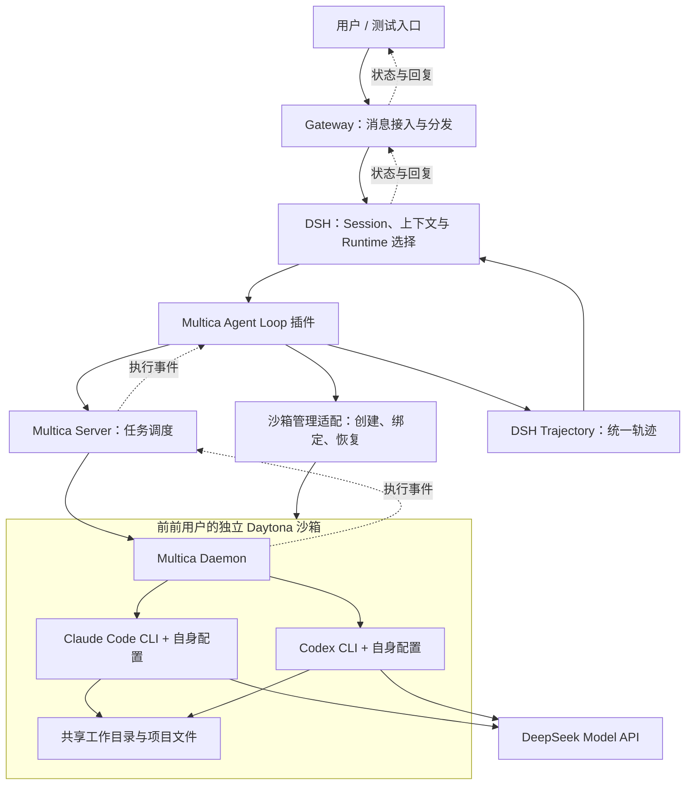

# DSH Agent MVP 目标与验收标准

确认日期：2026-09-14

> **范围说明（2026-09-16）**：本文前半部分记录单用户 Daytona 基础链路，作为底层执行闭环的历史验收依据。前前面向约 100 用户的目标、Profile/Daemon/Sandbox 隔离、按需 Host 和 DSH Hub 边界，以 [多租户目标与 DSH Hub 定位](../mvp/docs/multi-tenant-target.md) 为准；本文中的“多用户留待后续”不再代表最终产品目标。

范围变更：2026-09-14 用户决定本次先使用 Daytona，CubeSandbox 暂缓。原 CubeSandbox 的虚拟化、内核和存储卡点记录在 [CubeSandbox 暂缓原因](../mvp/docs/cubesandbox-blockers.md)，不再作为本轮完成前提。

部署修正：基础服务在本机 Windows 原生运行；需要 Docker 的依赖部署到 SSH Ubuntu。具体为 Windows 运行 Gateway、官方 DSH 和官方 Multica Server，Ubuntu 运行 Daytona 及 PostgreSQL 等容器依赖。官方 Multica Daemon、Claude Code CLI 和 Codex CLI 仍在 Daytona 沙箱内执行。

本文记录本次沟通确认的 MVP 范围与最终实现约束，作为实现与验收依据。与 `architecture.md` 中的长期规划不一致时，本次 MVP 以本文为准。

**最终会话模型（已落地）：** 一个 DSH Session 只对应一个 Multica Agent、Project 和 Chat Session。Codex/Claude 切换只调用 Multica 官方 Agent runtime 更新能力（`PUT /api/agents/{id}`），不创建新的 Chat，也不由 DSH 拼接 handoff。DSH Loop 只提交前前用户 prompt，并把 Multica 返回的状态、工具事件和文本投影为统一 Trajectory；Multica 负责 Chat 历史及 CLI provider session 的恢复/新建决定。

## 1. 核心目标

以 DSH 作为整体 Agent 基座，由 Gateway 接收和分发消息，通过自研 Multica Agent Loop 插件替换默认 `dsh-agent-loop`。插件连接 Multica Server，将任务交给 **Daytona 沙箱内的 Multica Daemon**，由 Daemon 调度 Claude Code CLI 或 Codex CLI 执行。

两个 CLI 使用各自的原生配置连接 DeepSeek Model API，执行各自的 Agent 循环。执行过程经 Multica 回传并同步到 DSH，轨迹统一由 DSH Trajectory 管理。

**Daytona 是本次 MVP 的必需组成部分。宿主机直接运行 Daemon 或普通目录执行只能用于局部调试，不能替代最终验收链路。**

**沙箱按用户归属：一名用户对应一个独立的 Daytona。** 同一用户的多个 DSH 会话复用该用户沙箱，不同用户的执行环境、文件与 CLI 配置隔离。

历史单用户验收阶段的 Gateway 固定一个由服务端配置的用户身份；前前 MVP 已在其外部加入多租户 Gateway、用户 Profile、按需 Host、个人 Sandbox/Daemon 和 Session 所有权。单用户真实执行证据与约 100 用户控制面测试分别记录，不能互相替代。

### 真实部署与执行的硬性要求

- 实际安装并运行官方 DSH 框架，通过真实插件机制加载本项目 Multica Agent Loop 插件，使用真实 Session、持久化及轨迹接口。
- 实际部署官方 Multica Server 及所需数据库，在真实 Daytona 内运行官方 Multica Daemon。不能用本仓库自建的 control-plane、daemon 或模拟 HTTP 服务替代官方框架进行验收。
- 实际部署并使用 Daytona 创建执行沙箱，沙箱中安装真实 Claude Code CLI 与 Codex CLI；Daemon 必须通过真实注册和调度链路执行任务。
- 两个 CLI 使用自身原生配置调用真实 DeepSeek Model API，实际执行命令、修改文件，并将真实执行事件同步到 DSH。
- Gateway 可以自研，但必须实际接收消息、路由至真实 DSH 并返回真实结果，不能通过预制界面、固定回复或伪造日志模拟执行链路。
- `bck/legacy-prototype/src/sim/`、内存宿主、mock API 和仓库内自建调度实现只能用于局部开发或单元测试。单元测试通过不等于真实集成验收通过，不能作为正式部署的静默降级路径。
- 固定并记录 DSH、Multica、Daytona、Daemon、CLI 与相关依赖的版本或提交号。本轮不修改 Multica 源码；若未来评估上游补丁，必须作为独立实验，不得混入默认部署链路。
- 真实依赖未部署、API 不兼容、Daemon 离线或模型调用失败时，明确报告未完成或失败，不以模拟后端、直接模型调用或宿主机执行宣称 MVP 完成。

部署交付需要提供可复现的安装配置与启动步骤、实际服务及健康状态、沙箱与 Daemon 注册信息，以及可关联的 DSH Session、Multica Task、CLI 执行日志和文件变更证据。报告和截图中不暴露凭据。

### 优先复用原则

有适用开源实现就优先复用，框架提供原生 API、SDK、配置项或插件扩展点就使用其原生能力。先核对所选版本的实际能力，再确定最小自研范围。DSH 的会话与轨迹、Multica 的调度与执行、Daytona 的沙箱生命周期，以及 CLI 的模型调用与内部执行能力均优先由各框架承担。

自研重点限于 Gateway 的业务路由、框架之间的身份与任务关联、必要事件转换、Runtime 切换和缺失的业务规则；不重复实现已有的调度器、持久化会话系统、沙箱引擎或 CLI Agent 循环。模块目录仅表达职责边界，能力由框架提供时以配置或薄适配完成，无需为了目录完整而自建子系统。实现中记录所复用的 API/组件和确有必要的自研缺口。

## 2. 总体架构



图中的沙箱管理适配是职责划分，具体封装为独立模块还是 DSH 插件，在实现时确定。

## 3. 各组件职责

| 组件 | 本次 MVP 职责 |
| --- | --- |
| Gateway | 接入消息，注入服务端配置的固定用户标识，依据会话标识分发给 DSH，处理重复消息，返回状态、过程和回复。先提供一个可测试入口，不实现多用户登录或全部聊天渠道。 |
| DSH | 平台统一基座，管理 Session、平台上下文、会话级 Runtime 选择，以及统一 Trajectory。 |
| Multica Agent Loop 插件 | 接管 DSH 执行入口，维护用户/沙箱/任务关联，调用 Multica 官方 Agent runtime 切换、提交与取消任务，接收事件并重连对账；不维护第二份 Chat 历史。 |
| Multica Server | 管理执行端连接与任务调度，接收 Daemon 上报的状态和执行事件。 |
| Daytona | 提供真实执行沙箱，承载 Daemon、CLI、配置和工作文件，支持本次验证需要的生命周期操作。 |
| Multica Daemon | 在沙箱内启动和管理 CLI 进程，将执行状态与事件报告给 Multica Server。 |
| Claude Code / Codex CLI | 使用自身配置调用 DeepSeek，负责各自的模型交互、内部上下文处理、工具调用和文件操作。 |

Gateway 的业务消息分发职责不能仅以现有预览网关的认证转发能力代替。

## 4. CLI 与模型配置

本轮实测配置已由用户确认：使用官方 DeepSeek 地址与 Flash 模型。2026-09-14 核对官方文档，模型标识为 `deepseek-flash`；Codex Base URL 为 `https://api.deepseek.com`，Claude Code Base URL 为 `https://api.deepseek.com/anthropic`。API Key 仅存于 Git 忽略的私有运行目录，本文不包含凭据。

- 沙箱同时准备 Claude Code CLI 和 Codex CLI，允许用户按 DSH 会话选择其中一个执行任务。
- 两个 CLI 分别使用各自的原生配置，配置 DeepSeek API 地址、模型标识、认证信息及必要的协议选项。
- CLI 配置目录独立，避免切换时覆盖另一 CLI 的配置；同一会话的两个 CLI 复用对应沙箱中的工作目录。
- DSH 和 Multica 负责组织与调度，不在插件中另建模型请求循环来替代 CLI 执行。
- 模型名称、API 地址及兼容配置不能凭假设写死；以部署时实际提供的信息和两套 CLI 的兼容性验证结果为准。
- 沙箱初始化时准备所需配置和凭据，凭据不提交到仓库，也不写入普通执行轨迹。

验收必须确认两个 CLI 分别真实调用了 DeepSeek。模拟后端、固定回复或插件直接请求模型均不能算作该目标完成。

## 5. 会话、沙箱与 Runtime 切换

平台以 `userId` 为键保存个人沙箱绑定、Profile、会话和任务归属。历史基础链路仍可用服务端固定身份运行；多租户 Gateway 通过 Token 或外部 SSO 注入实际用户身份，并拒绝客户端覆盖。控制面已覆盖多用户隔离，真实 100 用户生产压测仍需在目标部署环境执行。

需要维护以下关联：

```text
可信用户标识 → 该用户唯一的 Daytona 沙箱绑定
  ├─ 沙箱内 Multica Daemon、两套 CLI 配置和用户文件
  └─ 该用户的多个 Gateway / DSH 会话
       → 各会话的一个 Multica Agent、Project、Chat 与本地 Runtime 执行段关联
       → Multica Task 与执行事件
```

- Gateway 注入固定的服务端用户标识，不接受客户端任意指定或覆盖 userId；后端按该标识查询并校验会话、任务和沙箱绑定。未来通过身份适配层接入实际认证用户。
- 用户首次执行时按需创建个人沙箱，后续请求复用该绑定；并发首次请求需要互斥或幂等控制，避免为同一用户重复创建沙箱。
- 一个 DSH 会话在连续工作期间绑定所属用户的沙箱和明确的工作目录，不能把任务误发到其他用户的环境。
- 同一用户的新聊天和 Runtime 切换不创建新沙箱。多个会话保留各自的 CLI 会话与轨迹，不因复用沙箱而混合对话上下文。
- 同一用户可以在个人沙箱中并行运行多个平台任务，任务可以全部使用 Codex、全部使用 Claude Code，或混合使用两者。Runtime 是任务所属会话/执行段的选择，不是每用户只能占用一次的执行槽位。
- 平台任务并行与 CLI 内部的工具或子 Agent 并行分别处理；在所选 CLI 和 Multica 支持范围内保留 CLI 自身的并行能力，不以每用户或每沙箱单任务串行代替并发管理。
- 同一用户的多个会话可以访问个人沙箱中的文件；并行任务分别维护 CLI 会话、进程、任务状态和轨迹，不能混用同一可变的 CLI 会话状态。用户级模型配置可作为共同配置来源，任务产生的可变状态须隔离。
- 并行代码修改优先使用独立工作目录或 Git worktree。需要共享同一工作目录时，必须有明确的冲突写入协调策略；不同任务可独立执行的工作不因目录或沙箱级全局锁而被全部串行化。CLI 内部文件修改冲突的检测与协调方式需要在实现中验证。
- 并发上限按资源设置且可配置，验收至少覆盖同一用户同时运行两个 Codex 任务。Multica 的调度、Daemon 执行能力和 CLI 配置均需支持该场景，不能因为选择了同一种 Runtime 而将任务全部串行化。
- 取消操作只作用于指定任务及其所属子进程，不终止同一用户的其他并行任务。Runtime 切换作用于前前会话后续执行段，不改变其他会话的活跃任务。
- 为后续多用户扩展预留按 userId 分区的配置、工作目录和 Multica 执行目标映射。扩展时需要落实并验证不同用户的凭据、文件、任务与轨迹隔离；本次单用户验收不代表多租户隔离已经完成。
- Claude Code / Codex 切换按会话生效，不能依靠修改所有会话共用的全局配置实现。
- 切换前等待前前任务结束，或先取消并确认结束，再创建新的执行段。
- 同一聊天切换 CLI 时复用该用户的同一个沙箱与工作目录，使已有文件和变更连续可见。
- DSH Loop 只发送前前用户 prompt；Multica Chat 保存统一历史，并按官方能力决定目标 CLI provider session 的恢复或新建。DSH 不生成上下文 handoff，也不把自身历史复制进出站消息。
- 用户归属、平台会话、沙箱绑定、执行段、任务映射和事件同步位置需要持久化，不能仅保存在进程内存中。
- 沙箱恢复后重新确认 Daemon 在线、CLI 配置有效及工作目录可用，再接受新任务。

## 6. DSH 统一 Trajectory

DSH Trajectory 是平台侧的统一轨迹记录。Multica 可以保留自身执行日志，但用户在 DSH 中应能查看一次任务的完整可获取过程。

同步范围至少包括：

| 事件类别 | 需要记录的内容 |
| --- | --- |
| 用户输入 | 输入消息、来源、所属 DSH Session 与请求标识 |
| 任务生命周期 | 提交、排队、开始、完成、失败、取消，以及对应 Task、Runtime、沙箱 |
| 助手输出 | 可获取的增量输出与最终回复，避免重复追加 |
| 工具执行 | 可获取的工具名称、参数、结果和错误 |
| 执行产物 | 可获取的文件路径、文件变更或产物引用 |
| 耗时与用量 | 时间信息，以及上游实际提供的模型与 token 用量；缺失时明确为未知 |
| 原始事件 | 保留必要的 Multica/CLI 原始事件，便于定位转换问题 |

实现要求：

- 执行事件经 Daemon → Multica Server → 插件 → DSH 回传，不能只同步最终答案。
- 根据真实 DSH 事件接口实现转换和展示；未知事件保留原始信息，不伪造 DSH 原生模型事件。
- 使用稳定的事件标识或序号及持久化同步位置处理去重、重连和补传。
- 平台消息重试与任务提交状态不明时，先对账，避免重复执行。
- 会话日志恢复不等于外部 CLI 任务恢复，需要分别检查任务真实状态并记录结果。

## 7. 沙箱生命周期范围

本次需要验证：

1. 为用户按需创建独立的真实 Daytona 沙箱，持久化用户与沙箱绑定，准备两个 CLI、原生配置和工作目录。
2. 在沙箱内启动 Multica Daemon，注册到指定 Multica Server，并确认可调度。
3. 将该用户的 DSH 会话绑定到个人沙箱，完成真实任务；新建会话继续复用该沙箱。
4. 对空闲沙箱进行暂停与恢复验证；暂停前检查该用户全部会话的活跃任务。恢复后重新建立可用执行链路，保持用户归属，原有工作文件可继续使用。
5. 用户取消任务后确认 CLI 执行结束，并在 DSH 轨迹中记录取消结果。
6. 对沙箱离线、Daemon 断连和恢复失败给出明确状态，避免任务无限等待。

首轮暂停恢复验收针对空闲沙箱，使用选定 Daytona 版本真实支持的停止/启动或归档/恢复 API，验证文件与原生 CLI 配置保留，并重新启动或确认官方 Multica Daemon 在线。这里不承诺内存或进程现场保存；活跃任务的进程级无损迁移、跨节点内存恢复及任意网络连接透明恢复不作为默认保证。

关闭单个聊天不销毁个人沙箱。用户沙箱可以空闲暂停，不要求永久开机；沙箱故障后的重建需要明确的数据恢复流程，并确保旧执行实例不再接收该用户的新任务。

## 8. MVP 验收清单

2026-09-16：下列清单是单用户真实执行链路的历史验收记录，详见 [真实验收结果](../mvp/docs/acceptance-results.md) 和 [同一会话切换的试用说明](../mvp/docs/try-mvp.md)。共享 Chat 回归后原生审计包含 17 个会话、21 个真实任务；当前自动化模块测试 124 项通过。DSH 展示按原生 JSONL/Session 投影和 Gateway SSE 验证；共享目录拒绝策略通过真实 SQLite 多连接事务测试验证。面向 100 用户的控制面代码已补充，但真实容量、生产安全和多用户端到端验收仍需单独执行。长时间断线期间终态报告的上游持久化限制单独记录，不承诺无限断线自动恢复。

- [x] 实际部署官方 DSH、Multica Server 及所需数据库、Daytona 和沙箱内官方 Multica Daemon，记录版本、启动方式与健康检查结果。
- [x] 验收流量走真实框架与 CLI 链路，不使用模拟后端或静默降级；依赖故障能被识别并明确报告。
- [x] 用户消息经过 Gateway，到达正确的 DSH 会话，回复也经过 Gateway 返回。
- [x] Gateway 使用服务端配置的固定用户身份，首次并发请求仅创建一个个人 Daytona。
- [x] 同一用户新建多个会话、切换 CLI、重启 DSH 后，仍复用持久化的个人沙箱绑定。
- [x] 用户标识贯穿会话、沙箱、任务和轨迹映射；客户端不能覆盖固定身份或绕过该身份对应的绑定校验。
- [x] 同一用户在同一个个人沙箱内同时运行至少两个 Codex 平台任务，执行时间实际重叠，CLI 会话与轨迹互不混淆。
- [x] 验证多个 Claude Code 任务及 Claude Code / Codex 混合任务并行，Runtime 类型不限制同用户任务数量。
- [x] 并行代码任务使用独立目录或 worktree 时互不覆盖；共享目录时验证明确的冲突写入协调策略。
- [x] 取消一个并行任务不影响其他任务；切换一个会话的 Runtime 不改变其他活跃任务。
- [x] 任一会话仍有活跃任务时，不暂停该用户沙箱；并发额度不足时明确排队，并在额度释放后继续调度。
- [x] DSH 使用 Multica Agent Loop 插件接管执行入口。
- [x] 任务由 Multica Server 下发给真实 Daytona 内的 Daemon。
- [x] Claude Code CLI 使用自身配置调用 DeepSeek，在沙箱内完成文件修改并运行验证命令。
- [x] Codex CLI 使用自身配置调用 DeepSeek，完成同等类型的真实任务。
- [x] 同一 DSH 会话切换 CLI 后复用同一个 Multica Chat/Project/目录，能读取之前的工作文件；出站消息只有前前 prompt，历史由 Multica Chat 管理。
- [x] DSH 能展示可获取的执行过程，包括工具事件、状态与最终回复，而非仅最终文本。
- [x] 重复消息、重复事件及断线重连不会造成重复执行或重复写入轨迹。
- [x] 取消任务、CLI 失败、Daemon 离线均能正确结束或更新平台状态，并保留轨迹。
- [x] DSH 服务重启后，可以恢复会话、沙箱和任务映射，查询或对账已有任务的真实状态。
- [x] 空闲沙箱暂停恢复后，Daemon 恢复可用，两个 CLI 的配置与工作文件仍可用于继续任务。
- [x] 提供可重复的部署说明、配置示例及自动化测试，并留存端到端验收结果。
- [x] 端到端验收可通过 DSH Session、Multica Task、沙箱 ID 和真实文件变更相互核对；模拟测试结果与真实集成测试结果分开报告。

## 9. 前前环境与落地顺序

已检查的开发主机为 Ubuntu 22.04.5，8 vCPU、约 16GB 内存。停止指定实验容器后，可用内存约 7GB；`/home` 剩余约 131GB。以上均为检查时的快照。

项目源码与 Windows 基础服务位于前前项目目录，新实现集中在 `mvp/`。Windows 服务的运行数据与凭据放入 Git 忽略的 `.runtime/`；远程容器依赖、镜像、数据、缓存和日志放在 `/home/dev/dshagent-mvp/`。根分区检查时只剩约 481MB，原 Docker 数据目录仍在 `/var/lib/docker`；MVP 使用独立 Docker 实例，数据写入 `/home/dev/dshagent-mvp/runtime/docker-data`。

两机部署需验证三条连接：Windows 到 Daytona API，Windows Multica Server 到远程 PostgreSQL，以及 Daytona 沙箱内 Daemon 到 Windows Multica Server。分别配置控制端地址和沙箱可访问地址，不能将 Windows 的 `localhost` 直接下发到沙箱。若局域网入站不可达，可使用明确记录的 SSH 转发；服务健康与断线重连必须纳入真实验收。

该机器是 VMware 虚拟机，检查时未发现 `/dev/kvm`，加载 `kvm_intel` 返回不支持。用户因此决定暂缓 CubeSandbox，本次切换为 Daytona。需要先核实 Daytona 的可用官方版本、自托管部署及 Docker 存储要求；不能直接把原 CubeSandbox 的 KVM/PVM 条件套用于 Daytona，也不能把普通 Docker 容器伪称为 Daytona 沙箱。前前没有安装 PVM 内核或重启主机。

建议按以下顺序实现：

1. 验证 Daytona 执行环境，固定兼容的组件版本与持久化目录。
2. 制作沙箱初始化流程，分别跑通两个 CLI 通过原生配置访问 DeepSeek。
3. 在沙箱内接入官方 Multica Daemon，验证 Server 真实调度。
4. 完成 DSH Multica Agent Loop 插件和 Gateway 的消息闭环。
5. 完成统一 Trajectory 同步、持久化映射、Runtime 切换及异常对账。
6. 完成沙箱恢复验证与上述端到端验收。

## 10. 后续扩展范围

本次新代码位于项目 `mvp/` 目录，按业务职责模块化，目录语义和依赖边界见 [MVP 实现目录](../mvp/README.md)。Gateway、DSH 执行适配、任务编排、Multica 客户端、个人沙箱管理、CLI 配置、轨迹适配和持久化分离；模块通过明确接口协作，不以单个大文件或模拟框架承载整个实现。代码模块划分不要求拆成多个微服务。

在前前多租户控制面之上，企业级 SSO、细粒度角色权限、企业密钥托管、自动扩缩容、多进程高可用、多渠道同时接入，以及 Langfuse 等外部评测平台仍属于后续扩展。前前已提供 Token/身份适配、按用户归属的数据结构和绑定校验、用户 Profile/Skill/Daemon 管理及按需 Host。Skills/MCP 的完整管理与跨 Runtime 能力矩阵不作为核心闭环的前置条件；前前额外提供了 DSH Managed Skill → Multica Agent 绑定能力，供需要统一 Skill 的部署启用。

新增用户时，使用用户 Provisioning 工具创建 Profile、Token 和配额，再通过身份适配层接入组织登录；复用既有用户到 Sandbox、Daemon、Host 和 Session 的映射。不能仅添加登录界面就宣称多用户支持完成。

本次交付重点是：**Gateway → DSH → Multica → Daytona 内 Daemon → 原生配置调用 DeepSeek 的 CLI → DSH 统一 Trajectory** 的真实、可测试执行闭环。


