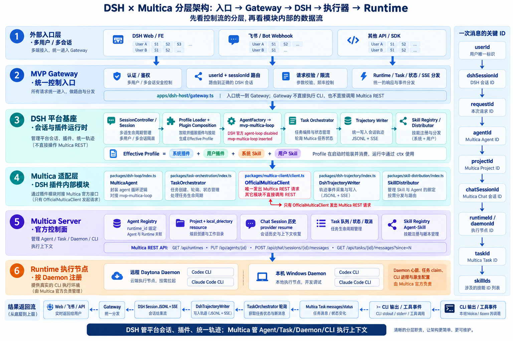
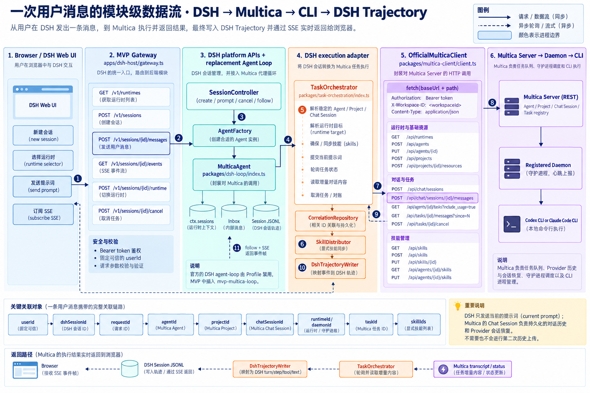
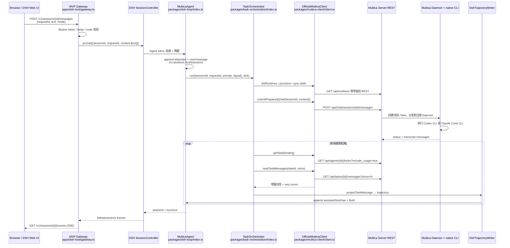
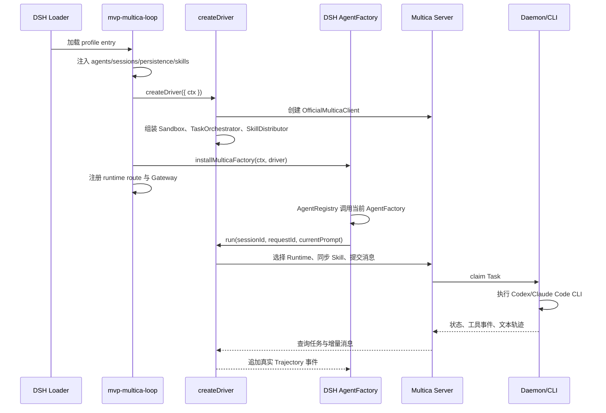

# DSH × Multica 架构说明

这份文档描述当前 MVP 的真实边界。DSH 负责平台会话和插件运行，Multica 负责 Agent、Runtime、Daemon 以及 CLI 任务。两者通过运行在 DSH Host 内的 `dsh-multica` 适配插件连接，Multica 源码没有嵌入 DSH。

## 0. 术语约定：DSH 底座与 Agent Loop

这里把“DSH 底座平台”作为产品层名称。它承载 Profile/Plugin Loader、Session、Persistence、Trajectory、Skill、Tool/MCP、权限、Web/UI 和 Gateway。它不是模型，也不是 CLI 进程。

“Agent Loop”是底座中的**执行引擎插槽**，也常被称为 Agent Runtime 或 Agent Executor。它反复执行“接收输入 → 组装上下文 → 调用模型或工具 → 处理结果 → 判断继续或结束”。DSH 官方 `agent-loop` Plugin 通过 `AgentFactory` 创建 DSH `Agent`，并负责 Inbox、turn/step、取消、恢复和生命周期。

当前 Profile 停用官方 `agent-loop`，插入 `mvp-multica-loop`。**DSH 仍是平台底座，只有默认执行循环换成了 Multica 适配型 Agent Loop。** `mvp-multica-loop` 遵守 DSH 的 `Agent/AgentFactory` 协议，把执行交给 Multica。它不是另一个 DSH 平台，也不是 Codex/Claude CLI。

| 名称 | 所属层 | 在本项目中的含义 |
| --- | --- | --- |
| DSH Platform / Host（DSH 底座） | 平台层 | 加载 Profile、提供 Session、Plugin、Trajectory、权限和 Web/UI |
| DSH `Agent` | DSH 运行对象 | 一个可被创建、恢复、发送消息、取消和释放的会话执行载体 |
| DSH `agent-loop` | DSH 执行引擎 | 官方默认 Agent Loop；本 MVP 被 `mvp-multica-loop` 替换 |
| `mvp-multica-loop` | DSH Runtime Plugin | DSH Agent Loop 适配器，调用 `TaskOrchestrator`，不直接调用 CLI |
| Multica Agent | Multica 控制面实体 | Runtime 绑定和任务调度身份；本 MVP 中与一个 DSH Session 稳定关联 |
| Multica Server | 执行控制面 | 管理 Agent、Chat、Task、Runtime、Daemon 和执行记录 |
| Multica Daemon | 执行节点 Worker | 在目标机器/沙箱领取 Task 并启动 CLI |
| Codex/Claude Code CLI | Provider 执行器 | 真正执行模型调用、工具操作和原生 CLI Session |

下文中，“Agent Loop”指 DSH 的执行引擎插槽，“Multica Agent”指 Multica 服务端的资源对象，“CLI Session”指 Codex 或 Claude Code 的原生 Provider 会话。三者不是同一层的对象。

## 1. 总体架构



总图按请求方向从上到下分成六层：外部入口、MVP Gateway、DSH 平台基座、DSH 插件内部的 Multica 适配层、Multica Server 控制面和 Runtime 执行节点。实线表示请求下行，虚线表示状态与轨迹上行。

DSH 平台基座中的 `AgentFactory → mvp-multica-loop` 是替换点。Profile 停用官方 `agent-loop`，再插入本项目的 `mvp-multica-loop`。`TaskOrchestrator`、`DshTrajectoryWriter` 和 `SkillDistributor` 是该插件的内部模块，不是额外的 Agent Loop。

图中的“飞书 / Bot Webhook”和“其他 API / SDK”是 Gateway 的扩展入口。当前 MVP 只落地浏览器/HTTP 入口，飞书和其他连接器还没有部署。

一条消息经过以下路径：

1. 用户通过 DSH Web 或 MVP Gateway 创建或恢复 DSH Session，然后发送 prompt。
2. DSH `AgentRegistry` 调用当前注册的 `AgentFactory`，创建或恢复 `MulticaAgent`。该 Agent 遵守 DSH 的 Session、Inbox、取消、空闲和生命周期协议。
3. `TaskOrchestrator` 为 Session 找到稳定的 Multica Agent、Project、Chat Session 和 Runtime。每条消息创建一个 Multica Task，但复用同一个 Chat Session。
4. DSH 只把当前 prompt 交给 Multica。Multica 按 Agent 的 Runtime 绑定把任务交给 Daemon，Daemon 再启动 Codex CLI 或 Claude Code CLI。
5. Multica 返回状态和消息。适配器把文本、工具调用、工具结果以及未识别事件写入 DSH Trajectory，最后通过 DSH Session/Gateway SSE 展示。

### 1.1 模块级数据流：谁请求 Multica，如何请求



这张图把入口请求和执行器调用分成两段。**MVP Gateway 不请求 Multica Server**，它只做 Bearer 鉴权、参数校验和路由，再调用 DSH `SessionController` 或本项目的 `TaskDriver`。Multica REST 请求全部由 `OfficialMulticaClient` 发出。该客户端由 `mvp/apps/dsh-host/create-driver.ts` 组装，并交给 `TaskOrchestrator`、`SkillDistributor` 和官方 Segment Provisioner 使用。

以 `POST /v1/sessions/{dshSessionId}/messages` 为例，调用顺序如下：



#### 请求边界与责任

| 顺序 | 模块 | 输入/输出 | 作用 |
| --- | --- | --- | --- |
| 1 | `apps/dsh-host/gateway.ts` | HTTP `/v1/*` | 只处理入口鉴权、参数校验、HTTP/SSE；不持有 Multica 业务逻辑。 |
| 2 | DSH `SessionController` | `create/prompt/cancel/follow` | 按 DSH 官方会话契约管理 Session 和 Agent 生命周期。 |
| 3 | `packages/dsh-loop/index.ts` | `MulticaAgent` | 替换官方 `agent-loop` 的执行位置，负责 Inbox、turn/step、flush、恢复和取消。 |
| 4 | `packages/task-orchestration/index.ts` | `TaskDriverRequest` | 把一次 DSH prompt 变成一次 Multica Task；维护 DSH requestId 与外部 taskId 的关联。 |
| 5 | `packages/task-orchestration/official-provisioner.ts` | Segment 资源 | 通过官方 API 确保稳定 Agent、Project、Chat Session 和 Daemon 目录资源。 |
| 6 | `packages/skill-distribution/index.ts` | DSH Skill 声明 | 在提交任务前把 DSH 管理的 Skill 同步到 Multica Agent；项目代码目录不上传。 |
| 7 | `packages/multica-client/client.ts` | `request(method, path, body)` | 唯一的 Multica REST 出口，统一拼接 `baseUrl + path`、鉴权头和 JSON。 |
| 8 | Multica Server / Daemon | Task、状态、增量消息 | Multica 负责队列、Agent runtime 绑定、Chat Session 历史/provider resume、Daemon 心跳和 CLI 进程。 |
| 9 | `packages/dsh-trajectory/index.ts` | Multica transcript | 将真实消息映射成 DSH assistant/tool/text/turn/step 事件并持久化。 |

`OfficialMulticaClient.request()` 只负责拼接地址、鉴权头和 JSON 请求体，实际形态如下：

```ts
fetch(`${baseUrl}${path}`, {
  method,
  redirect: 'error',
  headers: {
    Accept: 'application/json',
    Authorization: `Bearer ${token}`,
    'X-Workspace-ID': workspaceId,
    ...(body === undefined ? {} : { 'Content-Type': 'application/json' }),
  },
  body: body === undefined ? undefined : JSON.stringify(body),
});
```

提交任务时，DSH 只发送当前消息的 `content`，并在末尾加上 `<!-- dsh-request:... -->` 标记，用于故障对账。长期对话历史和 Provider resume 由 Multica Chat Session 管理，DSH 不再上传第二份完整历史。`CorrelationRepository` 保存并校验 Multica 返回的 `task_id`、`message_id`、`seq` 和 `status`；轨迹读取使用 `since=N` 游标，避免重复写入。

#### 主要 Multica API 映射

| DSH 适配模块调用 | 官方 Multica API | 触发时机 |
| --- | --- | --- |
| `listRuntimeDescriptors()` / `selectRuntime()` | `GET /api/runtimes` | 页面加载 Runtime 列表、创建执行段、Runtime 切换前检查 Daemon 心跳。 |
| `createAgent()` / `switchAgentRuntime()` | `POST /api/agents`、`PUT /api/agents/{id}` | 一个 DSH Session 首次绑定稳定 Agent，或在任务边界切换 Codex/Claude/Daemon。 |
| `createDirectoryProject()` / `createProjectResource()` | `POST /api/projects`、`POST /api/projects/{id}/resources` | 为目标 Daemon 登记会话工作目录；本机目录和 Daytona 目录都由 resource 描述。 |
| `createChatSession()` | `POST /api/chat/sessions` | 一个 DSH Session 首次创建稳定的 Multica Chat Session。 |
| `submitPrepared()` | `POST /api/chat/sessions/{id}/messages` | 每个用户 prompt 创建一个新的 Multica Task，但复用同一个 Chat Session。 |
| `getTask()` | `GET /api/agents/{id}/tasks?include_usage=true` | 轮询状态、校验 Agent/Chat/Runtime 绑定。 |
| `readTaskMessages()` | `GET /api/tasks/{id}/messages?since=N` | 增量读取文本、工具调用、工具结果和原始事件。 |
| `cancelTask()` | `POST /api/tasks/{id}/cancel` | DSH 取消后请求 Multica 取消，并等待 Daemon 侧执行停止和 transcript flush 的证据。 |
| `MulticaSkillDistributor` | `GET/POST/PUT /api/skills*`、`GET/PUT/POST /api/agents/{id}/skills*` | 提交当前 Task 前同步 DSH 管理 Skill 并绑定到稳定 Agent。 |

请求方只有一条边界链：**Gateway → DSH → `MulticaAgent` → `TaskOrchestrator`/`SkillDistributor` → `OfficialMulticaClient` → Multica Server。**

## 2. DSH 和 Multica 的关系

两套系统的职责边界如下。DSH 保存平台状态，Multica 保存执行状态。

| 责任 | DSH | Multica |
| --- | --- | --- |
| 用户会话 | DSH Session、用户消息、Session JSONL、浏览器连接 | 保存与 DSH Session 对应的 Chat Session |
| Agent 循环 | DSH `Agent`/`AgentFactory` 生命周期、Inbox、turn/step 边界 | 执行侧 Agent 的 Runtime 绑定和任务调度 |
| Runtime | 页面选择和会话级选择记录 | 真实 Runtime 注册、Daemon 心跳、Codex/Claude provider |
| 任务 | DSH requestId、幂等和本地状态 | 官方 Task 创建、排队、执行、取消和状态 |
| 上下文 | DSH 保存可展示的事件和轨迹 | Multica Chat Session 保存发送给 CLI 的聊天历史，并处理 provider session 恢复 |
| 文件/环境 | 选择工作目录、Daytona 个人沙箱生命周期 | 使用 Project resource 和 Daemon 在目标目录执行 |
| Skill | 管理源文件、版本、来源和同步策略 | 保存 Skill，并在执行任务时注入给目标 CLI |

在这个 MVP 中，Multica 是执行器和执行上下文管理器，DSH 是平台基座以及用户可见的会话、插件和轨迹层。DSH 不复制 Multica 的队列、Daemon 注册、CLI 循环或 Chat 历史，接入只使用 Multica 官方 REST API，不修改 Multica 源码。

### 可观测性边界：当前未接 Langfuse

当前 Multica Server/Daemon 没有把 Task、Chat 或 CLI 工具事件自动发送到 Langfuse。它把任务、消息、状态、轨迹和用量保存在自己的服务端或数据库中。MVP 的 `DshTrajectoryWriter` 将这些事件投影到 DSH Session JSONL 和 Gateway 流，代码中没有 Langfuse SDK、Langfuse API 或 OTLP exporter 配置。

依赖锁文件中的 `@opentelemetry/*` 不代表已经接入 Langfuse，Daytona 的 `otelEnabled: false` 也不能证明存在 Langfuse 链路。当前以 DSH Trajectory 作为权威记录，DSH 和 Multica 内部轨迹可查询，外部 Langfuse Trace 暂不上报。若以后需要跨会话评测、成本分析或长期存储，再增加异步 Observability Plugin/Exporter，不能阻塞主执行链。

### 同一个 DSH Session 的上下文如何保存、恢复和切换

上下文分三层保存。DSH 不会把整段历史拼成一个无限增长的 Prompt，逐条重新发给 CLI。

```text
DSH Session S1（平台会话 / JSONL 事件日志）
  ├─ turn、step、用户消息、状态、工具调用和轨迹
  └─ 由 DSH Session Persistence 持久化，重启后可 resume
        │
        └── 稳定关联
             ├─ Multica Agent A1
             ├─ Chat Session C1（稳定上下文）
             ├─ Project P1（稳定工作目录）
             ├─ Task/Run T1 → remote Codex
             ├─ Task/Run T2 → remote Claude Code
             └─ Task/Run T3 → local Codex
                    │
                    └─ 目标 Daemon 上的 CLI 原生会话
```

消息处理过程如下：

1. 创建 DSH Session 时，平台同时创建或恢复一个稳定的 Multica Agent 和一个 Multica Chat Session。Chat Session 是该 DSH 会话的执行上下文载体。
2. 每条消息先写入 DSH JSONL，再调用 `POST /api/chat/sessions/{id}/messages` 发送当前内容。Multica 为这条消息创建一个内部 Task/Run，但继续使用同一个 Chat Session。
3. `DshTrajectoryWriter` 将 Multica 返回的文本、工具调用、工具结果、状态和序号增量写回 DSH Session。SQLite 保存 `requestId → taskId → agentId/chatSessionId/runtimeId`，进程重启后可以对账。
4. Runtime 只能在 Task 完成或取消已确认后切换。切换更新稳定 Agent 的 `runtime_id`，不更换 DSH Session、Multica Agent、Chat Session 或 Project。下一条消息在新 Runtime 上创建新的 Task。
5. 目标 Runtime 能继续使用原生 Codex/Claude 会话时，Multica 会继续该 Provider Session。跨 CLI 或跨机器导致原生会话不可用时，Multica 可以根据同一 Chat Session 的历史创建新的 Provider Session。DSH 不执行 handoff，也不能保证两个 CLI 的隐藏状态完全一致。

“上下文”有明确边界：DSH 保存平台事件和审计轨迹，Multica 保存 Chat 历史和执行记录，CLI 保存 Provider 原生会话。工作目录、未提交文件和 CLI 缓存属于 Runtime 资源，不会因 DSH Session 相同而自动跨机器复制。

**Multica Chat Session 不做定期摘要或压缩。** 它保存 Chat 消息历史，供运行时读取。压缩发生在下游的 **Multica Daemon / CLI Provider Session**：Codex 或 Claude Code 接近上下文窗口时，可能执行 native compaction。压缩成功则继续原 Provider Session；压缩失败或原会话不可恢复时，运行可能报告 `context_overflow` 或创建新的 Provider Session，Chat 历史仍保留。

Profile 中的 `compression: "none"` 只表示 DSH JSONL 不做 gzip 等存储压缩。当前适配层不上传完整历史，也没有自定义 `/compact` 或自动摘要流程，只记录 Multica 返回的压缩或溢出结果。需要更可控的长会话策略时，应优先使用 Multica/CLI 官方 compaction，或增加显式的摘要确认步骤。

### Chat、Task 和 Work/Issue 的区别

Multica 的 Chat 和正式 Issue 是两种入口。“Work”不是当前 REST 客户端的统一模式字段。MVP 使用 **Chat 入口**：

```text
DSH Session
  → Multica Chat Session
      → POST /api/chat/sessions/{chatSessionId}/messages
          → Multica 为这条消息创建一个内部 Task/Run
              → Daemon → Codex/Claude Code CLI
```

这几个名称分别表示：

| 名称 | 当前 MVP 是否使用 | 含义 |
| --- | --- | --- |
| **Chat** | 是 | 不依附 Issue 的一对一对话；历史由 Multica Chat Session 保存。每条消息都会触发一次执行。 |
| **Task/Run** | 是，作为 Chat 的内部执行记录 | Multica 为每条 Chat 消息创建的排队、运行、状态和轨迹记录；它不是看板上的正式 Issue。 |
| **Work / Issue** | 否 | 有标题、描述、负责人、状态、优先级和团队协作记录的正式工作项，需要调用 Issue/assignment 相关 API。 |
| **`in_place` / `worktree`** | 当前为 `in_place` | Project 的目录执行方式，分别表示直接修改目录或使用 Git worktree 隔离；它和 Chat/Issue 是另一组概念。 |

简单问答、方案讨论和临时小修改走 Chat 即可，不需要 Issue。需要负责人、状态、审核或团队交付物时，再增加 Work/Issue 路径。同一 DSH Session 若要按消息切换两种入口，需要增加 `interactionMode` 和 Issue 关联，不能把 Chat Session ID 当作 Issue ID。

Gateway 有两个位置：`MVP Gateway` 是项目自己的 HTTP 入口，负责鉴权、权限校验、路由分发以及状态/轨迹转发；DSH 的 `Web / Connection / UI` 是 Host 内的 Web Host、连接认证和 UI 服务。MVP Gateway 通过 `SessionController`、`AgentFactory` 等 DSH 接口进入平台，两者不是同一个 Gateway。

Profile 的加载、消费和与 Skill Registry 的关系见第 3.3～3.4 节；运行时切换仍只更新稳定 Agent 的 `runtime_id`，不会伪造 DSH handoff prompt，也不会重新上传项目代码。

### 多用户、多 Session 的边界

当前实现的 100 用户目标、用户 Profile、Sandbox、Daemon Registry 和 DSH Hub 定位见[多租户目标与 DSH Hub 定位](multi-tenant-target.md)。Gateway 先认证并校验 `userId + sessionId`，再让 `HostSupervisor` 按需启动该用户的 DSH Host；同一用户的多个 Session 共享这个 Host，不同用户使用各自的 Host/Profile 和 Sandbox。

Profile 的“组装”只发生在用户 Host 启动前：`ProfileComposer` 合并系统基线、用户 Plugin manifest 和 Skill catalog，DSH Loader 随后消费一次并调用插件 `apply(ctx)`。运行期间每条请求只查找已有 Session/Agent；Skill 可以刷新到活动 Host 并在下一条 Task 生效，Plugin 变更则通过新的 Profile revision 重启该用户 Host。这样 Host 不会随每条请求重复创建，也不会把不受信任的用户 Plugin 动态注入共享进程。

## 3. `dsh-multica` 插件如何工作

插件入口是 [multica-plugin.ts](../apps/dsh-host/multica-plugin.ts)。Profile 生成器 [create-profile.mjs](../apps/dsh-host/create-profile.mjs) 会生成完整的启动补丁；其中与替换 Agent Loop 直接相关的是两项：

```text
关闭官方 agent-loop
插入 mvp-multica-loop
```


### 3.1 替换 DSH Agent Loop：可复用的最小模板

读者只需要记住一条链路：

```text
DSH 提供 Agent 契约
  → 插件实现 AgentFactory
    → 插件创建自己的 Agent
      → Agent 把消息交给自己的 Executor
        → Executor 调用具体后端
```

**DSH 提供的部分**

- 插件加载约定：`apply(ctx)` 和宿主 `ctx`。
- Agent 创建约定：`AgentFactory.createAgent()`、`AgentFactory.resume()`、`AgentHandle`。
- Agent 运行约定：消息入队、启动、取消、等待空闲、维护和状态。
- 会话基础设施：Session、Persistence、Inbox、turn/step 投影和 Agent Registry。

**插件必须实现的部分**

- 一个插件入口 `apply(ctx)`。
- 一个 `AgentFactory`，负责创建和恢复 Agent。
- 一个实现 DSH Agent 行为的 Agent 类。
- 一个内部 Executor（本项目中命名为 `TaskDriver`），把 Agent 的一次输入交给具体后端。
- 将后端事件写回 DSH Trajectory。

下面是可以复用于其他 Agent Loop Plugin 的伪代码。`[DSH]` 是 DSH 提供的能力，`[本项目]` 是插件代码；当前项目的 `TaskDriver` 使用 Multica。

```ts
// [DSH] Loader 在启动时调用；这里完成一次插件装配。
async function apply(ctx: DshContext): Promise<void> {
  const executor = createExecutor(ctx);                 // [本项目] 创建后端执行器；当前实现是 Multica。

  ctx.sessionProjections.register(turnBoundaryProjectionDefinition); // [DSH] 注册 turn/step 恢复信息。

  const factory: AgentFactory = {                       // [本项目] 实现 [DSH] 创建/恢复契约。
    async createAgent(ownerCtx, options): Promise<AgentHandle> {
      const session = await createDshSession(ctx, options); // [本项目] 封装 DSH Session/Persistence 创建。
      return attachAgent(ownerCtx, session, executor);      // [本项目] 返回 AgentHandle。
    },

    async resume(ownerCtx, options): Promise<AgentHandle> {
      const session = await openDshSession(ctx, options);   // [本项目] 封装 DSH Persistence 恢复。
      return attachAgent(ownerCtx, session, executor);      // [本项目] 在原 Session 上恢复 Agent。
    },
  };

  ctx.agents.setFactory(factory);                       // [DSH] 把官方 AgentFactory 替换为本插件的 factory。
}

async function attachAgent(ownerCtx, session, executor): Promise<AgentHandle> {
  const agent = new MulticaAgent(session, executor);    // [本项目] Agent 类；其他插件替换成自己的 Agent。
  registerAndAnnounce(ownerCtx, agent);                 // [本项目] 封装 DSH Agent/Session Registry 登记。
  agent.start();                                        // [本项目] 开始消费 Inbox。

  return {
    agent,
    dispose: async () => {                              // [本项目] 实现 [DSH] AgentHandle 的释放契约。
      agent.cancel({ kind: 'disposed' });
      await agent.whenIdle();
      await agent.scope.dispose();
    },
  };
}

class MulticaAgent implements Agent {                   // [本项目] 实现 [DSH] Agent 契约。
  send(message, target, wakeup) {                       // [本项目] 实现 [DSH] 方法；消息先进入 Inbox。
    inbox.append(target, message);
    if (wakeup) this.kick();                            // [本项目] 唤醒内部循环。
  }
  followup(message) { this.send(message, 'next-turn', true); } // [本项目] 实现 [DSH] 的下一轮语义。
  steer(message) { this.send(message, 'next-step', true); }   // [本项目] 实现 [DSH] 的下一步语义。
  cancel(cause) { this.abortController.abort(cause); }        // [本项目] 实现 [DSH] 取消语义。

  async drain() {                                       // [本项目] Agent 的内部循环。
    const messages = inbox.claim('next-turn');          // [DSH Inbox] 取出待处理消息。
    await ctx.sessions.flush(session);                  // [DSH Session] 先持久化用户输入。
    await executor.run({                                // [本项目] 进入后端执行器。
      sessionId: session.id,                            // [DSH] 当前会话身份。
      requestId: requestIdOf(messages),                 // [DSH] 来自用户消息的请求 ID。
      prompt: textOf(messages),                         // [DSH] 来自 Inbox 的用户文本。
      signal: abortSignal,                              // [DSH] 来自 cancel() 的取消信号。
    }, event => trajectoryWriter.append(event));         // [本项目] 后端事件映射回 DSH Trajectory。
  }
}

// [本项目] 内部端口；不是 DSH API。
interface Executor {
  run(request, emit): Promise<void>;                    // 成功表示后端任务结束，事件通过 emit 返回。
}

// [本项目] 当前 Multica 实现：配置 → OfficialMulticaClient → TaskOrchestrator → Multica Server。
function createExecutor(ctx: DshContext): Executor {
  return new TaskOrchestrator({ client, repository, skillDistributor, sandbox });
}
```

其中 `createDshSession`、`openDshSession`、`registerAndAnnounce`、`requestIdOf` 和 `textOf` 都是示意性的本项目辅助函数，分别封装 DSH Session/Persistence/Registry 和消息字段读取。实现其他 Agent Loop 时保留 DSH 契约和生命周期，只需替换 Agent 类与 `createExecutor()`；本项目把 Executor 换成 Multica，其他插件可以接入别的执行后端。

一句话概括：**DSH 负责 Agent 的外部生命周期，插件负责 Agent 的内部循环，Executor 负责接入具体执行后端。**

### 3.2 插件内部模块边界

架构图第 4 层的五个方框属于同一个 DSH Plugin。它们既不是五个 Agent，也不是五个 DSH Plugin：

| 模块 | 是否直接请求 Multica | 主要职责 |
| --- | --- | --- |
| `MulticaAgent`（`packages/dsh-loop/index.ts`） | 否 | 实现 DSH `Agent`，处理 Inbox、turn/step、Session flush、恢复和取消；将当前 prompt 交给 `TaskDriver`。 |
| `TaskOrchestrator`（`packages/task-orchestration/index.ts`） | 间接 | 关联 DSH Session 与 Multica Agent/Project/Chat/Task，选择 Runtime，提交任务，轮询状态和增量消息。 |
| `OfficialMulticaClient`（`packages/multica-client/client.ts`） | **是，唯一 REST 出口** | 统一 `fetch(baseUrl + path)`、Bearer token、`X-Workspace-ID`、JSON 编解码和响应校验。 |
| `DshTrajectoryWriter`（`packages/dsh-trajectory/index.ts`） | 否 | 把 Multica 的真实 transcript/status 映射成 DSH assistant/tool/raw/turn/step 事件并持久化。 |
| `SkillDistributor`（`packages/skill-distribution/index.ts`） | 间接 | 读取 DSH Skill，调用 `OfficialMulticaClient` 的 Skill API，并绑定到稳定 Agent。 |

调用链是 `Gateway → SessionController → MulticaAgent → TaskOrchestrator → OfficialMulticaClient`。只有最后一个模块跨出 DSH 进程访问 Multica Server。

#### 先把“插件”和“模块”分开

上表的五个名字都参与 Multica 集成，但它们不是五个插件。在这组执行模块中，Profile 加载的入口只有一个：
`mvp-multica-loop`，入口文件是 [multica-plugin.ts](../apps/dsh-host/multica-plugin.ts)，入口导出 `apply(ctx)`。
Profile 还可以加载 `mvp-runtime-selector` 这样的独立 UI 插件，但它不属于下表的 Multica 执行模块。
入口的 `apply(ctx)` 负责组装这些内部模块，并把它们接到 DSH 服务上：

```text
mvp-multica-loop                         一个 DSH Plugin（一个运行时边界）
├─ apps/dsh-host/multica-plugin.ts       Profile 加载的入口：apply(ctx)
├─ packages/dsh-loop/index.ts            DSH Agent/AgentFactory 适配器
├─ packages/task-orchestration/index.ts 任务、Runtime 和 Multica 资源编排
├─ packages/multica-client/client.ts     唯一的 Multica REST 客户端
├─ packages/dsh-trajectory/index.ts      Multica 事件 → DSH Trajectory
└─ packages/skill-distribution/index.ts DSH Skill → Multica Skill/Agent 绑定
```

这些目录都在同一个 DSH Host 进程内运行，不是独立微服务，也不会各自注册 Agent。`packages/*` 表示代码依赖边界：只有 `multica-client` 能发 Multica REST 请求，`dsh-loop` 只依赖内部的 `TaskDriver` 端口。这样可以分别测试和替换模块。Plugin 的边界由 Profile 加载的入口和 `apply(ctx)` 决定，不由物理目录名决定。

如果以后希望目录名也表达这个边界，可以增加 `plugins/multica-loop/` 门面目录，重新导出这些包。那只是目录整理，不会改变 DSH 接口契约。

### 3.3 Profile 定义长什么样

Profile 是 DSH 启动时使用的 **插件组合/补丁数组**，由 `create-profile.mjs` 生成 JSON 文件。它描述停用、插入和配置哪些插件，不描述用户消息，也不保存 Multica Task。

当前 MVP 生成的结构如下，运行时路径会写成绝对路径：

```json
[
  { "id": "agent-loop", "disabled": true },
  {
    "insert": [
      { "id": "mvp-multica-loop", "name": "<absolute>/apps/dsh-host/multica-plugin.ts", "config": {} }
    ]
  },
  {
    "id": "session-persistence-jsonl",
    "config": { "root": "<absolute>/sessions", "compression": "none" }
  },
  { "id": "session-title-llm", "disabled": true },
  { "id": "ui-model-selection", "disabled": true },
  { "id": "ui-settings-models", "disabled": true },
  {
    "insert": [
      { "id": "mvp-runtime-selector", "name": "<absolute>/packages/ui-runtime-selector/index.mjs", "config": {} }
    ]
  }
]
```

字段含义是：

- `id`：匹配已经存在的 DSH Plugin；`disabled: true` 表示本次 Host 不启用它。
- `insert`：向本次 Profile 新增插件；`name` 是要加载的模块路径，`config` 是传给插件的配置。
- `config`（不带 `insert`）：修改已经存在插件的配置，例如 JSONL Session 持久化目录。

### 3.4 DSH 怎样加载和消费 Profile

Profile 有三个阶段：生成、启动消费、运行期使用 `ctx`。

1. `start-host.ps1` 调用 `create-profile.mjs` 写入 `.runtime/mvp.cordis.json`。文件使用私有权限，不提交到 Git。
2. `start.mjs` 读取 `DSH_MVP_PROFILE_PATCH`，校验官方 `agent-loop` 已停用且 `mvp-multica-loop` 已插入，然后启动 `bootstrap.mjs web --patch <profile> --no-open`。
3. DSH Loader 加载官方基础 Plugin，应用 `disabled / config / insert`，并在加载 `mvp-multica-loop` 时调用 `apply(ctx)`。
4. `apply(ctx)` 声明依赖，通过 `ctx.inject()` 等待 `webServer`、`connection`、`sessionController` 等服务，再安装 AgentFactory、Runtime 路由和 Gateway。
5. Host 进入运行态后不再读取 Profile。Agent 直接使用已装配的 `ctx.sessions`、`ctx.sessionPersistence` 和 `ctx.sessionProjections`。

启动过程可以表示为：

```ts
// 这是 start.mjs / bootstrap.mjs 的概念流程，不是 DSH 内部源码。
// Profile 是“启动时装配清单”，不是每条消息都重新执行的路由表。
const profile = readJson(process.env.DSH_MVP_PROFILE_PATCH);

// 启动前先做安全断言：必须关闭官方 loop，并加载我们的 loop。
// 如果配置不满足这两个条件，程序应直接失败，避免启动两个 Agent Loop。
assert(profile.some(p => p.id === 'agent-loop' && p.disabled === true));
assert(profile.some(p => p.insert?.some(x => x.id === 'mvp-multica-loop')));

// 先创建 DSH Host；此时还没有处理用户消息。
const dsh = await bootstrapWebHost({ noOpen: true });

// 依次应用 Profile：禁用旧插件、修改插件配置、加载新插件。
// loadPlugin 会调用 mvp-multica-loop.apply(ctx)，由插件完成服务注册。
for (const patch of profile) {
  if (patch.disabled) dsh.disablePlugin(patch.id);
  if (patch.config) dsh.configurePlugin(patch.id, patch.config);
  for (const entry of patch.insert ?? []) {
    await dsh.loadPlugin(entry.name, entry.config);
  }
}
await dsh.ready();
```

Profile 决定 **启动时装配哪个 Agent Loop**，不负责运行时的 Codex/Claude 切换。运行时切换由已加载的 `TaskOrchestrator` 调用 Multica Agent 的 `runtime_id` 更新接口完成。

### 3.5 运行期执行循环与启动顺序

`MulticaAgent` 把一条 DSH 用户消息转换成一次 Multica Task，再把 Multica 事件写回同一个 DSH Session。
下面省略并行 Inbox、取消确认、断线对账和失败回滚，只保留执行边界：

```ts
async function executeOneTurn() {
  // 1. 从 DSH Inbox 取出待执行的消息；这里决定 turn/step 的归属。
  const messages = inbox.claim('next-turn', turn);

  // 2. 先把用户输入写入 DSH Session，形成可恢复的本地事实。
  session.append('step/start', { turn, step });
  for (const message of messages) {
    session.append('user/message', message);
  }
  // 在调用外部 Multica 前必须 flush；进程崩溃后可以从这个边界恢复。
  await ctx.sessions.flush(session);

  // 3. 只把当前 prompt 交给内部 TaskDriver。
  // TaskDriver 内部会选择 Runtime、调用 OfficialMulticaClient、轮询 Task。
  await driver.run(
    { sessionId: session.id, requestId, prompt: textOf(messages), signal },
    async (event, binding) => {
      // 4. Multica 的每个文本/工具/状态事件都转换成 DSH Trajectory。
      // writer 不生成假的结果，只记录 Multica 实际返回的事件。
      await trajectoryWriter.append(event, { ...binding, turn, step });
    },
  );

  // 5. 外部 Task 完成后关闭本地 step/turn，并再次落盘。
  session.append('step/end', { turn, step });
  session.append('turn/end', { turn, reason: 'completed' });
  await ctx.sessions.flush(session);
}
```

这段代码的边界很明确：`MulticaAgent` 遵守 DSH 生命周期，`driver.run()` 进入 Multica 编排；CLI、Daemon、队列和 Provider 历史由 Multica 负责。启动时序是 `create-profile.mjs` 生成 Profile，`start.mjs` 校验，Bootstrap 加载 Profile，插件执行 `apply(ctx)`，`createDriver()` 组装适配器，最后 `ctx.agents.setFactory()` 接管 Agent Loop。每条消息都复用已经加载的 Profile。

DSH 仍使用官方 Agent、Session、Persistence 和 Web，实际执行循环由 `MulticaAgent` 接管。内部编排模块不通过 `ctx.plugin()` 单独加载。下图展示启动和首次执行的关键步骤：



模块职责和代码链接见 3.2 的边界表。`dsh-loop/index.ts` 是 DSH 替换点，其余包是内部适配模块；沙箱生命周期由 `sandbox-management/index.ts` 提供。

## 4. DSH 提供的 `ctx` 是什么

`ctx` 是 Cordis 上下文，提供依赖注入、插件作用域、事件和清理能力。它不是用户请求，也不是模型聊天历史。插件通过 `ctx` 获取 DSH 服务、注册事件、加载子插件和登记清理逻辑。

Cordis 的公共基础属性包括：

| 属性 | 作用 |
| --- | --- |
| `ctx.root` | 当前应用的根上下文 |
| `ctx.events` / `ctx.on` / `ctx.emit` | 事件总线 |
| `ctx.logger` | 结构化日志 |
| `ctx.reflect` | 服务解析和注册反射层 |
| `ctx.registry` | 插件注册表 |
| `ctx.inject(deps, fn)` | 等依赖服务可用后运行回调，服务变化时可重新加载 |
| `ctx.plugin(plugin, config)` | 在当前作用域加载另一个插件 |
| `ctx.effect(cleanup)` | 注册插件/作用域销毁时的清理逻辑 |
| `ctx.extend()` / `ctx.isolate()` / `ctx.intercept()` | 创建子作用域、隔离服务或拦截配置 |

`ctx` 中有哪些 DSH 服务，取决于 Profile 实际装载了哪些插件。`mvp-multica-loop` 使用以下服务：

| 服务 | 当前用途 |
| --- | --- |
| `ctx.agents` | 通过官方 AgentRegistry 安装/调用自定义 `AgentFactory` |
| `ctx.sessions` | prepare/enter/announce/flush DSH Session |
| `ctx.sessionPersistence` | 读写 JSONL 会话日志 |
| `ctx.sessionProjections` | turn 边界和消息投影 |
| `ctx.skills` | 可选读取官方 DSH Skill Registry |
| `ctx.sessionController` | 官方 Web/API 会话 create、prompt、cancel、follow |
| `ctx.webServer` | DSH Host 的 HTTP 服务和路由注册表；插件用 `webServer.register()` 注册 `/mvp/runtime`、`/mvp/skills` 等路由。它承载请求，但不负责 Multica 任务编排。 |
| `ctx.connection` | DSH 官方浏览器连接认证层；`requestRejection(req)` 检查 Host/Origin 和浏览器认证，返回 `401/403` 或允许继续。它负责连接级认证，不替代 Gateway 的用户权限判断。 |

它们和项目自建 Gateway 的关系是：浏览器访问 DSH Host 时，先由 `ctx.connection` 做连接认证，再由 `ctx.webServer` 找到插件路由；外部 API 访问 MVP Gateway 时，则先通过 Gateway 自己的 Bearer 校验，再进入 DSH `SessionController`。两条路径最后都在 DSH 内部处理 Session，不直接让浏览器调用 Multica。

Profile 还可以提供 `ctx.tools`、`ctx.fs`、`ctx.mcp`、`ctx.sandbox`、`ctx.subprocess`、`ctx.credentials`、`ctx.approvals`、`ctx.settings`、`ctx.jobs` 和 `ctx.web`。服务是否可用取决于对应插件和当前作用域；读取未注入的服务会被 Cordis 拒绝，因此插件需要声明 `inject`。

插件会接触到两种作用域：

- **Host ctx**：插件启动时拿到的宿主上下文，用于注册全局服务、路由、Gateway 和 AgentFactory。
- **Agent ctx**：`AgentFactory` 为单个 Agent 创建的子作用域。它继承宿主服务，也可以拥有该 Agent 的工具、提示片段、监听器和权限。`MulticaAgent.ctx` 用于绑定 Session 事件和轨迹 writer，不会再嵌套一个 Multica Agent。

## 5. 如何自定义 DSH Plugin

Cordis 支持函数、类和带 `apply(ctx, config)` 的对象作为插件入口。插件可以声明 `name`、`Config`、`inject`、`provide` 和 `intercept`。常用写法如下：

```ts
import z from '@deepseek-ai/schemastery';

export const name = 'my-runtime-observer';
export const inject = ['sessions', 'logger'];
export const Config = z.object({ enabled: z.boolean().default(true) });

export function apply(ctx: any, config: { enabled: boolean }) {
  if (!config.enabled) return;
  const off = ctx.on('session/event', (_session: unknown, event: unknown) => {
    ctx.logger('my-runtime-observer').info('session event', { type: (event as any).type });
  });
  ctx.effect(() => off);
}
```

本项目通过 Profile 加载插件，不在业务代码里手工 `new`：

```js
{ id: 'my-runtime-observer', name: './my-runtime-observer.ts', config: { enabled: true } }
```

插件依赖的服务应列入 `inject`。对尚未加载的可选服务，使用 `ctx.inject([...], callback)`，不要直接读取 `ctx.someService`。监听器、定时器、文件句柄、数据库连接和子进程都通过 `ctx.effect()` 登记清理。依赖不可用或初始化失败时，Loader 应停止加载该插件。

当前 [multica-plugin.ts](../apps/dsh-host/multica-plugin.ts) 是完整示例：声明依赖、创建真实 Driver、注册 Runtime 路由，并把 Gateway 和 Host 生命周期接入 `ctx.effect`。

## 6. DSH 可以定义哪些类型的 Plugin

DSH Plugin 可以按职责分成以下几类；一个插件可以覆盖多类职责，但边界要明确：

| 类型 | 典型职责 | 官方/当前例子 |
| --- | --- | --- |
| Profile/Composition | 启停、替换或组合其他插件 | `create-profile.mjs`、Loader entry |
| Agent/Runtime | 实现 `AgentFactory`、Runtime 选择、外部执行循环 | `mvp-multica-loop` |
| Session/Persistence | Session 创建、事件投影、JSONL/数据库持久化、恢复 | `dsh-session-persistence-jsonl` |
| Skill | 发现、读取、展示和注入 `SKILL.md` | `dsh-skill`、`dsh-skill-filesystem`、本项目 Skill Distributor |
| Tool/MCP | 注册模型工具、MCP Client、工具调用结果 | `dsh-tool-*`、`dsh-mcp-client` |
| Command | `/compact`、`/goal`、`/todo` 等用户命令 | `dsh-command-*` |
| Gateway/API | HTTP/RPC/SSE 路由、身份和外部系统适配 | `dsh-api-*`、本项目 Gateway |
| Web/UI | 前端 module、输入栏槽位、设置页、轨迹展示 | `dsh-client-ui-*`、`ui-runtime-selector` |
| Sandbox/FS/Process | 文件、Shell、子进程、沙箱和权限策略 | `dsh-fs-*`、`dsh-subprocess-*`、`dsh-sandbox-*` |
| Policy/Approval | 权限、用户确认、凭据和安全边界 | `dsh-authorization`、`dsh-user-approval` |
| Observability | Trajectory、统计、OTel、评测和审计 | `dsh-session-telemetry`、本项目 `dsh-trajectory` |

Skill、Tool Plugin 和 Runtime Plugin 的边界不同：

- Skill 是模型可读的指令/资源包，本身不应直接管理进程。
- Tool/MCP Plugin 提供模型可调用的能力，必须定义输入校验、权限和结果格式。
- Runtime Plugin 改变 Agent 的执行方式，必须实现官方生命周期、持久化、取消和恢复协议。
- UI Plugin 只负责展示和交互，不能绕过后端身份校验或直接持有 Multica token。

## 7. 当前自定义 Skill 的分发路径

示例 Skill 位于 [mvp/skills/anime-phrase-transformer/SKILL.md](../skills/anime-phrase-transformer/SKILL.md)。配置 `managedSkillsDir` 后，Driver 在提交任务前执行以下同步：

```text
SKILL.md / ctx.skills
        ↓
DSH Skill declaration + version + sha256 marker
        ↓  Multica 官方 API
Multica Skill
        ↓  Agent-Skill assignment
当前 Session 的稳定 Multica Agent
        ↓
目标 Daemon → Codex CLI / Claude Code CLI
```

Skill 的 `config.dshagent` 保存稳定 key、版本和摘要。重复启动会更新同一个 DSH-owned Skill；没有 DSH 标记的同名外部 Skill 不会被覆盖。辅助文件会随 Skill 包同步，项目代码目录不会上传。

## 8. 当前实现边界

- 一个 DSH Session 对应稳定的 Multica Agent、Project 和 Chat Session；每条消息对应一个独立 Multica Task。
- Runtime 只能在当前 Task 完成或取消确认后切换，切换通过 Multica Agent 的 runtime binding 完成。
- 同一用户的多个 DSH Session 可以并行，前提是目录、沙箱和 Daemon 并发额度允许。
- DSH 中的 Skill、MCP、工具、Memory 和 UI Plugin 不会自动出现在 CLI 中，必须做显式适配并检查 Runtime 支持范围。
- Multica Daemon 的注册、心跳、任务领取和 CLI 执行仍由官方二进制负责。MVP 不在 DSH 内重复实现队列。
- 当前代码已在 Gateway 外层提供用户认证/身份适配、Profile/Daemon/Sandbox 所有权和按需 Host；Hub-wide 节点与审计查询只对显式配置的运维用户开放。真实 100 用户部署与压力验收仍需在目标服务器完成，不能把本地自动化测试当成生产容量证明。

## 9. 相关文档与代码

- [MVP README](../README.md)：目录、启动和测试入口。
- [部署手册](deployment-handbook.md)：Windows/Ubuntu/Daytona 的真实部署步骤。
- [DSH 集成说明](dsh-integration.md)：官方 Agent、Session、Persistence 和事件契约。
- [Multica 集成说明](multica-integration.md)：实际调用的官方 API、Runtime、Task 和轨迹边界。
- [试用说明](try-mvp.md)：Runtime 切换、Skill 同步和真实 CLI 验收命令。
