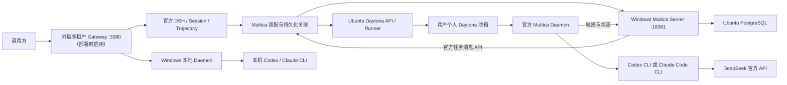

# MVP 实现与跨机器部署手册

> 网页入口已补充：输入栏的“执行器”会列出同一 Multica 工作区中所有在线 Daemon 的 Codex / Claude Code runtime（例如“Claude（Windows）· Claude Code”），绑定当前 DSH 会话；任务进行中禁止切换，刷新会从服务端恢复选择。无需在 DSH 网页再次配置模型 Key。已有安装运行新版 start-host.ps1 会自动补齐插件 profile（先备份）。

更新日期：2026-09-16。本文是当前 MVP 的部署入口，描述已经运行的实现、从空环境安装的方法和运维边界。早期设计文档中的“待验收”记录属于历史阶段，最终结果以本文及 [真实验收结果](acceptance-results.md) 为准。

**当前环境已完成单用户基础执行链路的真实部署和验收；多租户 Gateway/DSH Hub 控制面代码已实现并通过自动化测试，但尚未在 100 用户目标环境做真实容量和端到端验收。第二套空白机器尚未实际执行本手册。** 当前不是一键安装产品：Linux 网卡/目录、身份初始化、模型 catalog 和构建产物校验仍需部署人员配置。不要把本机 `.runtime` 整目录复制成另一套独立部署。

**当前默认部署路径使用官方未修改的 Multica Server/Daemon。** 本仓库保留的 `dshtrace1/dshtrace2` 是历史可靠性实验，不是安装前置条件；默认健康检查只依赖官方字段、Task 状态/消息和沙箱进程核验。若明确选择历史补丁，必须使用独立快照名、二进制摘要和单独回归记录，不能把补丁验收证据写成默认能力。

## 1. 已经实现什么

- 历史单用户验收使用固定可信用户；当前多租户 Gateway 通过 Token 或外部身份适配层识别用户，负责会话、消息、Runtime 选择、取消和 SSE，并拒绝客户端覆盖用户身份或任意工作目录。
- 官方 DSH 是会话、原生事件和 trajectory 的基座。通过 AgentFactory 装配 Multica loop，禁用默认模型 loop，执行由真实 Multica Server/Daemon 完成。
- 每个用户绑定一个持久化 Daytona 沙箱。远程 Multica Daemon、Codex CLI、Claude Code CLI 在沙箱内运行；用户 Windows 也可以启动一个官方 Daemon，自动注册本机 CLI。多个会话复用远程沙箱，不为每个任务创建沙箱。
- 同一工作区的每个 Daemon 会自动发现 PATH 上的 Codex / Claude Code 并注册为 runtime。DSH 通过 `GET /api/runtimes` 展示真实注册结果，选择项携带 `runtimeId + daemonId`，不会按名称猜测机器。
- **同一个 DSH session 可以 Codex → Claude Code → Codex。** 每个 DSH 会话只创建一个 Multica Agent、Project 和 Chat Session；切换时只通过官方 Agent 更新接口改绑 `runtime_id`，本地执行段只做任务关联。每次提交当前 prompt，Multica Chat 负责历史与 CLI 原生 session 的恢复决定。
- 同一 Session 切换到另一台 Daemon 时仍复用同一个 Agent、Project、Chat Session；Multica Project 增加该 Daemon 的 `local_directory` 资源，代码目录不上传，跨机器只同步会话上下文、任务状态、轨迹和结果。
- 不同会话可同时执行两项 Codex、两项 Claude 或混合任务；Daemon 配额为 2，第三项由官方 Multica 排队。同一会话的活跃执行期间不能切换 Runtime；共享目录的冲突写入会被拒绝。
- 两个 CLI 使用自身原生配置调用 DeepSeek Flash，没有自建模型协议代理。Multica 原始事件、真实工具调用及结果、最终文本和状态被同步到 DSH。
- SQLite 保存用户/沙箱/会话/执行段/任务关联、提交意图和同步游标。提交结果不明确时查询官方记录对账，不盲目再次执行。DSH 先持久化事件再推进游标。
- 已实现取消后的进程核验、空闲沙箱暂停/恢复、Daemon 重新装配，以及短时 Server 断线的轨迹补传。

### 当前验证证据

145 项自动化测试通过。历史真实验收涉及 17 个 DSH 会话、21 个真实任务：19 completed、1 cancelled、1 failed；最新多租户验收又使用独立 `user-003` 完成真实个人 Sandbox、Daemon 和 Codex → Claude Code → Codex 同会话往返。覆盖同会话双向 Runtime 切换、同类/混合并行、两槽排队、单任务取消、真实 CLI 故障、Daemon 恢复、暂停恢复、冷启动幂等对账及短断线补传。多租户控制面仍需在目标环境完成 100 用户压力测试。

原始失败尝试没有覆盖为成功，见 [验收结果](acceptance-results.md)。私有证据存于 `.runtime/driver/` 和 `.runtime/dsh/acceptance/`，不会随源码分发。新部署需要重新做自己的验收。

## 2. 架构和模块边界



| 目录 | 职责 |
| --- | --- |
| `mvp/apps/dsh-host` | 官方 DSH 启动、profile、Gateway、生产依赖装配 |
| `mvp/packages/dsh-loop` | 官方 AgentFactory、turn/inbox、执行及恢复 |
| `mvp/packages/dsh-trajectory` | 官方任务事件到 DSH 原生轨迹的投影与去重 |
| `mvp/packages/multica-client` | 官方 REST API 的薄适配 |
| `mvp/packages/task-orchestration` | 会话执行段、提交对账、目录协调 |
| `mvp/packages/sandbox-management` | 官方 Daytona SDK 生命周期、Daemon bootstrap |
| `mvp/packages/cli-configuration` | 两套原生 CLI 配置生成 |
| `mvp/packages/persistence` | SQLite 持久化与一致性约束 |
| `mvp/deploy` | Docker、SSH、补丁、快照和启动入口 |

旧 `bck/legacy-prototype/src/`、`bck/legacy-prototype/dsh-multica-runtime/` 不属于本次生产执行链路。可以继续接入 DSH 插件，但需要检查插件是否依赖默认模型 loop；保留 DSH 插件机制不等于所有插件已经通过兼容测试。多租户 Gateway 的认证、授权、Profile、Daemon/Sandbox 所有权和配额代码已位于 `apps/multi-tenant-gateway` 与 `packages/tenant-control`。当前开发机监听的 3380 仍是单用户 DSH Host 内部 Gateway；要启用多租户入口，应按本手册创建私有 `DSH_TENANT_CONFIG` 并启动 `npm run start:tenant-gateway`，不能把现有单用户进程当成多租户服务。100 用户的真实容量、TLS、SSO 和灾备验收仍未完成。

## 3. 本次部署位置与版本

| 项目 | 本次值 |
| --- | --- |
| Windows 源码根目录 | `C:\Users\zcxu\Documents\dshagent` |
| 私有状态 | 源码根目录下 `.runtime/` |
| 上游源码及编译产物 | 同级 `dshagent-upstream/` |
| Ubuntu | `192.168.3.146`，Ubuntu 22.04.5，8 vCPU / 16 GiB |
| Ubuntu 专用目录 | `/home/dev/dshagent-mvp/` |
| 独立 Docker socket | `unix:///run/dshagent-docker/docker.sock` |
| Docker 数据目录 | `/home/dev/dshagent-mvp/runtime/docker-data` |
| 网络 | `dshagent-daytona`，bridge `mvpday0`，`10.203.0.0/24` |
| Windows Node | 24.15.0 |
| 官方 DSH | npm `0.1.5-rc.2`，本项目 Session / Inbox 导出补丁 |
| Multica | 源码 `8908fcfbc43d18fc515dec747a100fecccc33556`，Go 1.26.6 |
| Server / Daemon | 官方未修改固定提交；数据库迁移按该提交执行（历史 `dshtrace1/dshtrace2` 仅作可选实验） |
| Daytona / SDK | 0.187.0；Compose 中固定镜像摘要 |
| 沙箱 Codex / Claude Code | 0.154.0 / 2.1.270 |
| 模型 | 本次实测 `deepseek-flash` |
| 快照 | 新部署使用 `dsh-mvp-cli-official-codex01540-claude21270`（需重新构建并填写摘要），2 CPU / 3 GiB / 8 GiB；旧 dshtrace 快照仅保留回退 |

资源数字是实测部署配置，不是任意任务的容量保证。本次 Ubuntu 检查时可用内存约 6.4 GiB，但根分区仅约 480 MiB，故所有新增 Docker 状态放 `/home`。新机器应留出镜像构建、数据库、任务文件的增长空间，先检查 `free -h`、`df -h` 和现有容器占用。

CubeSandbox 暂未部署：当前 VMware 未暴露 KVM；PVM 路径涉及内核变更和重启。用户决定先使用 Daytona，未修改内核或 root 密码。Daytona 的本次 Docker 方案已实际运行，不要求该 VM 具备嵌套 KVM。详细卡点见 [CubeSandbox 记录](cubesandbox-blockers.md)。DSH Hub 部署参照社区项目 `k1412/dsh-hub` 的锁定提交；它提供节点控制面，不自动提供终端用户租户隔离。

## 4. 新机器准备与路径约定

本手册复现 **Windows 控制面 + Ubuntu Docker 执行面**。Windows 无需 Docker；全 Linux 控制面并未通过本项目启动脚本验收。

Windows 安装 Git、Node 24.15.0（含 npm）、Go 1.26.6、PowerShell 7、OpenSSH Client。Ubuntu 安装可工作的 Docker Engine/Compose v2、Node（配置生成器使用）、Python 3、socat、iptables、openssl、apache2-utils；需要 systemd、sudo、overlay2 和 IPv4 转发。安装渠道按各软件官方发行方式选择，不用随机远程安装脚本替代版本核验。

以下 Windows 命令默认在项目根目录执行。把 `C:/work` 换为你的目录；推荐仍保留两个同级目录以便使用启动脚本默认值。

```powershell
git clone https://github.com/ChenXplorer/dshagent.git C:/work/dshagent
Set-Location C:/work/dshagent
$Project = (Get-Location).Path
$Upstream = Join-Path (Split-Path $Project) 'dshagent-upstream'
New-Item -ItemType Directory -Force $Upstream | Out-Null
npm ci --prefix mvp
node mvp/apps/dsh-host/patch-session.mjs
node mvp/apps/dsh-host/patch-loop-primitives.mjs
npm run typecheck --prefix mvp
npm test --prefix mvp
```

**源码交付检查：** 本次新增代码必须已包含在你取得的 Git 提交或源码包中；本文不表示当前工作区改动已经推送远程。确认存在本手册和 `mvp/package-lock.json` 后再安装。源码包不包含 `.runtime`、node_modules 或账号密钥。记录 `git rev-parse HEAD` 作为部署版本。只有使用历史 DSH 兼容补丁时才按对应说明应用，默认安装不修改 Multica 源码。

在 Windows 创建 `.runtime/{ssh,multica,daytona,driver,secrets}`，限制 `.runtime` ACL 仅部署账号及必要系统管理员可读。Windows 的 POSIX `0600` 参数不代替 NTFS ACL。后续示例中的密钥占位符必须在私有文件内填写，不能粘贴真实值到共享终端或 Git。

## 5. 构建真实 Multica

```powershell
git clone https://github.com/multica-ai/multica.git "$Upstream/multica"
git -C "$Upstream/multica" checkout --detach 8908fcfbc43d18fc515dec747a100fecccc33556
New-Item -ItemType Directory -Force "$Upstream/build/multica" | Out-Null
Push-Location "$Upstream/multica/server"
go build -ldflags '-X main.commit=8908fcfbc43d18fc515dec747a100fecccc33556 -X main.version=official' -o "$Upstream/build/multica/multica-server.exe" ./cmd/server
go build -o "$Upstream/build/multica/multica-migrate.exe" ./cmd/migrate
$env:GOOS='linux'; $env:GOARCH='amd64'; $env:CGO_ENABLED='0'
go build -ldflags '-X main.commit=8908fcfbc43d18fc515dec747a100fecccc33556 -X main.version=official' -o "$Upstream/build/multica/multica-linux-amd64" ./cmd/multica
Pop-Location
Remove-Item Env:GOOS,Env:GOARCH,Env:CGO_ENABLED
Copy-Item "$Upstream/multica/server/migrations" "$Upstream/build/multica/migrations" -Recurse
Get-FileHash "$Upstream/build/multica/multica-linux-amd64" -Algorithm SHA256
```

以上在没有预设 GOOS/GOARCH/CGO_ENABLED 的专用构建终端执行；有自定义值时自行保存并恢复。每一步确认退出码成功后再继续。Server 使用 Windows 产物，Daytona 快照和用户 Daemon 使用同一份经摘要核验的 Linux 官方产物。

SQL 没有嵌入 exe，完整 `migrations/` 必须随产物部署。按固定官方提交运行迁移工具，不需要应用本项目 Multica 源码补丁；补丁修改原因、校验和与历史数据库测试见 [轨迹补丁说明](multica-trace-durability.md)。

**构建摘要注意：** Go 产物会因构建环境不同而有不同 SHA256。将 `Get-FileHash` 输出保存到私有部署记录，并通过 `DSH_MULTICA_SHA256` 传给快照脚本；脚本会拒绝摘要不匹配的二进制。不要把历史 dshtrace 摘要填入默认快照，也不要删掉校验。

## 6. Ubuntu Docker 依赖

将本项目 `mvp/deploy/` 上传到 `/home/dev/dshagent-mvp/source/mvp/deploy/`，脚本应使用 LF 换行。所有新增数据放专用目录。

### 6.1 先适配本机参数

`isolated-docker.sh` 当前固定 `root=/home/dev/dshagent-mvp`、`uplink=ens160`、网段和 bridge。在其他机器用 `ip route` 确认真实出口网卡，检查网段不冲突后修改这些明确参数。两个 relay 脚本、Compose 和 driver 中的 bridge 地址需一起对应。IPv4 转发必须已启用；脚本会拒绝在关闭状态启动。

```bash
cd /home/dev/dshagent-mvp/source
sudo bash mvp/deploy/daytona/isolated-docker.sh start
sudo bash mvp/deploy/daytona/multica-relay.sh start
sudo docker -H unix:///run/dshagent-docker/docker.sock info
```

镜像下载需要代理时，用 `sudo --preserve-env=HTTP_PROXY,HTTPS_PROXY,NO_PROXY` 启动独立 Docker。`registry-proxy-relay.sh` 默认转发到本机已有 `127.0.0.1:8118`，**它不创建代理服务**。新机器直连正常就不启用；需要时先配置可用 HTTP 代理、调整 relay 目的端口，再启动 relay，并在 Daytona 私有 `.env` 添加 `DAYTONA_RUNNER_HTTP_PROXY=http://10.203.0.1:18119`。

### 6.2 生成 Daytona 配置

使用交互方式设置 Dex 密码，不把密码写入命令行。配置生成只运行一次；发生部分写入失败时检查现有文件，不通过删除密钥文件盲目重跑。

```bash
umask 077
export DAYTONA_DOCKER_NETWORK=dshagent-daytona
export DAYTONA_MINIO_IMAGE='quay.io/minio/minio@sha256:cf3dadcfa1fb0324f43958bad1abba986d53c4ecc04d4d50b46c7dcda28bd3cd'
read -r -s -p 'Daytona login password: ' MVP_LOGIN_PASSWORD
printf '\n'
export DAYTONA_LOGIN_PASSWORD_HASH="$(printf '%s\n' "$MVP_LOGIN_PASSWORD" | htpasswd -niBC 10 mvp | cut -d: -f2)"
node mvp/deploy/daytona/create-config.mjs /home/dev/dshagent-mvp/runtime/daytona
unset MVP_LOGIN_PASSWORD DAYTONA_LOGIN_PASSWORD_HASH
```

生成 `.env`、`dex.json` 和 state 目录。容器使用非 root UID 时，应根据固定镜像 `Config.User`/实际进程 UID 设置相应 bind 目录所有者。Dex 需要读 `dex.json` 并写 `state/dex`；不要对全部 state 或 `/home` 使用 `chmod 777`。检查容器日志中的 permission denied 后对准确目录修复。此权限映射目前仍是手工安装步骤。

```bash
sudo docker -H unix:///run/dshagent-docker/docker.sock compose \
  --env-file /home/dev/dshagent-mvp/runtime/daytona/.env \
  -f mvp/deploy/daytona/compose.json \
  -f mvp/deploy/daytona/windows-upload.compose.json config --quiet
sudo docker -H unix:///run/dshagent-docker/docker.sock compose \
  --env-file /home/dev/dshagent-mvp/runtime/daytona/.env \
  -f mvp/deploy/daytona/compose.json \
  -f mvp/deploy/daytona/windows-upload.compose.json up -d
sudo bash mvp/deploy/daytona/init-storage.sh
```

始终带 MinIO overlay，否则 Windows 上传构建上下文所需的 39000 端口消失。使用仓库现有固定 Compose 即可，正常安装不用重新运行 `derive-compose.mjs`。

Runner `NO_PROXY` 包含外层 `10.203.0.0/24` 以及内层 `runner-bridge` 实际网段（本次 `172.20.0.0/16`）。新机器必须核对内层 Docker 网络并同步调整；遗漏会让 Toolbox `/version` 健康检查走外部代理而创建超时。Runner privileged 和嵌套 Docker 是本方案实际执行要求。

### 6.3 Multica 专用数据库

在 `/home/dev/dshagent-mvp/runtime/multica/.env` 私有文件中配置：

```dotenv
MULTICA_DB_PASSWORD=<生成的高强度密码>
MULTICA_DB_DATA=/home/dev/dshagent-mvp/runtime/multica/postgres
```

创建目录后，使用同一个独立 Docker socket 启动独立 Compose 项目：

```bash
sudo docker -H unix:///run/dshagent-docker/docker.sock compose \
  --env-file /home/dev/dshagent-mvp/runtime/multica/.env \
  -f mvp/deploy/multica/compose.json up -d
```

数据库监听 Ubuntu loopback 35432。Daytona 自己的数据库由 Daytona Compose 管理，两者不能混用。

## 7. SSH 通道与地址

| Windows 入口 | Ubuntu 目的 | 用途 |
| --- | --- | --- |
| 33000 | 33000 | Daytona API / dashboard |
| 34000 | 34000 | 官方 Toolbox proxy |
| 35556 | 35556 | Dex OIDC |
| 35432 | 35432 | Multica PostgreSQL |
| 9000 | 39000 | MinIO 上传 |
| 反向 Windows 18381 | Ubuntu loopback 18381 | Multica Server |

为部署创建自己的 SSH 密钥，私钥放 `.runtime/ssh/id_ed25519`，公钥通过管理 SSH 安装到目标用户 authorized_keys。先确认宿主机指纹，再测试 key 登录；不要使用 `StrictHostKeyChecking=no`。可以限制此专用 key 只允许上述端口转发，不复用需要交互管理的密钥。SSH 服务必须允许本地及反向转发。

```powershell
./mvp/deploy/windows/start-tunnel.ps1 -SshHost '<Ubuntu地址>' -SshUser '<账号>' -IdentityFile "$Project/.runtime/ssh/id_ed25519"
```

该命令在专用窗口保持前台运行。其他窗口继续安装。沙箱访问 Server 的地址为 `http://10.203.0.1:18382`，由 relay 转入反向隧道；不能配置 Windows localhost。默认端口已经占用时，需同步修改隧道、Compose、Dex issuer/redirect、bootstrap-auth、启动参数和 driver，不是只改一个配置。

## 8. Windows Server、身份与模型配置

### 8.1 Multica

创建私有 `.runtime/multica/windows-env.json`：

```json
{
  "DATABASE_URL": "postgres://multica:<URL编码后的密码>@127.0.0.1:35432/multica?sslmode=disable",
  "JWT_SECRET": "<新生成的随机密钥>",
  "PORT": "18381",
  "APP_ENV": "development",
  "ALLOW_SIGNUP": "true",
  "DISABLE_WORKSPACE_CREATION": "false"
}
```

```powershell
./mvp/deploy/windows/start-multica.ps1 -Action migrate
./mvp/deploy/windows/start-multica.ps1 -Action start
Invoke-RestMethod http://127.0.0.1:18381/readyz
node mvp/deploy/multica/bootstrap-local.mjs
```

非推荐同级目录布局时传入启动脚本的 `-BinaryDirectory` 和 `-SourceDirectory`。本地开发模式验证码只写私有 stdout；bootstrap 调用真实身份/workspace/PAT API，结果写 `.runtime/multica/auth.json`，不打印凭据。PAT 有期限（初始化为 90 天），到期需要轮换。不要把该开发身份模式直接公开到公网。

### 8.2 Daytona 登录与快照

将第 6 节设定的密码通过私有编辑器写入 Windows `.runtime/daytona/login-password`，然后执行：

```powershell
node mvp/deploy/daytona/bootstrap-auth.mjs
```

固定登录名 `dev@daytona.local`；生成私有 `api-key.json` 和 OIDC 文件。通过官方组织 API 设置该个人组织默认区域为 `us`，请求 `PATCH /api/organizations/{organizationId}/default-region`，body `{"defaultRegionId":"us"}`，使用该部署的 OIDC 身份和组织 header；读回确认。不得把本机旧 organizationId 当新部署的 ID。详见 [快照说明](../deploy/sandbox/README.md)。

然后执行 `node mvp/deploy/sandbox/create-snapshot.mjs`，等官方状态为 active 并生成 `.runtime/daytona/snapshot.json`。基线二进制和摘要按第 5 节准备。MinIO bucket 已初始化且隧道 9000 正常才可构建。构建脚本仅在进程内把 `minio` 解析到 loopback，保留签名 Host，不修改系统 hosts。创建结果不明确且 intent 已存在时先查询官方快照，不删除 intent 重试。

### 8.3 DeepSeek catalog 和完整 driver

原生 Codex 使用 Responses API；Claude 使用 Anthropic 兼容 API。本次 model 均为 `deepseek-flash`。原生模型 catalog 来自 DeepSeek 官方 Codex 接入分发资料，保存为 `.runtime/driver/codex-models.json`。本次文件 SHA256 为 `d47876f3bca395fe2d9d3c7fc7312282a60da8a2479dd13b995cb8e0fe2695dd`，声明最低 CLI 0.144.0。它是模型元数据，不含 key，可作为经核验部署附件转交。获取新版时记录来源与摘要并重新测试，不能凭空编造 catalog，也不必执行远程 setup 脚本。官方来源与字段说明见 [CLI 配置依据](cli-configuration.md)。

把下面的完整结构写到私有 `.runtime/driver/config.json`，替换所有尖括号字段。Windows 路径用 `/`；`userId`、workspace 和 PAT 来自本次 auth.json；Daytona API key 取 api-key.json 的 `response.value`。daemonId 首次生成 UUID 后持久保存，重启不重新生成。`nativeCatalog.sha256` 必须对应实际文件。

```json
{
  "userId": "<Multica userId>",
  "defaultRuntime": "codex",
  "correlationDatabase": "C:/work/dshagent/.runtime/driver/correlation.sqlite",
  "daytona": {
    "apiUrl": "http://localhost:33000/api",
    "apiKey": "<Daytona API key>",
    "organizationId": "<Daytona organizationId>",
    "target": "us",
    "snapshot": "dsh-mvp-cli-official-codex01540-claude21270"
  },
  "multica": {
    "localApiUrl": "http://127.0.0.1:18381",
    "token": "<Multica PAT>",
    "workspaceId": "<Multica workspaceId>"
  },
  "managedSkillsDir": "C:/work/dshagent/mvp/skills",
  "managedSkills": [],
  "syncDshSkills": true,
  "dshSkillSources": ["project-dsh", "user-dsh", "custom", "bundled"],
  "daemon": {
    "home": "/home/daytona/dsh-mvp",
    "daemonId": "<新部署持久 UUID>",
    "serverUrl": "http://10.203.0.1:18382",
    "workspaceId": "<与 multica.workspaceId 相同>",
    "token": "<与 multica.token 相同>",
    "workspacesRoot": "/home/daytona/dsh-workspaces",
    "maxConcurrentTasks": 2,
    "binaryLocalPath": "C:/work/dshagent-upstream/build/multica/multica-linux-amd64",
    "expectedDaemonVersion": "official",
    "expectedCodexVersion": "0.154.0",
    "expectedClaudeVersion": "2.1.270",
    "nativeCli": {
      "codexHome": "/home/daytona/dsh-mvp/.codex",
      "claudeHome": "/home/daytona/dsh-mvp/.claude",
      "codex": {
        "baseUrl": "https://api.deepseek.com",
        "model": "deepseek-flash",
        "apiKeyEnv": "DEEPSEEK_API_KEY",
        "wireApi": "responses",
        "modelCatalogPath": "/home/daytona/dsh-mvp/.codex/models.json"
      },
      "claude": {
        "baseUrl": "https://api.deepseek.com/anthropic",
        "model": "deepseek-flash",
        "apiKeyEnv": "DEEPSEEK_API_KEY"
      }
    },
    "nativeCatalog": {
      "localPath": "C:/work/dshagent/.runtime/driver/codex-models.json",
      "sha256": "<实际 catalog SHA256>"
    },
    "secrets": { "DEEPSEEK_API_KEY": "<本部署 DeepSeek key>" }
  }
}
```

面向多用户时，`standardRuntime.userOverrides` 必须为每个用户提供独立的 Multica workspace/token 和 Daemon 身份；标准装配不会默认把新用户回退到共享 workspace。`allowSharedMulticaWorkspace: true` 仅用于单用户受控调试，不能用于 100 用户部署。

### 8.3.1 DSH Managed Skills

`managedSkillsDir` 是可选的 DSH Skill 源目录，约定每个 Skill 使用
`<目录>/<skill-name>/SKILL.md`，正文前可以放简单的 YAML 元数据：
`name`、`description`、`version`。同目录下除 `SKILL.md` 外的文件会作为辅助文件一起上传。
也可以直接在私有配置的 `managedSkills` 数组中写入 `{key,name,version,description,content,files,config}`。
如果 DSH 已通过官方 `ctx.skills` 注册了 Skill，可将 `syncDshSkills` 设为 `true`；
driver 会读取 DSH 的 Skill Registry，再走同一条 Multica 同步链路。`dshSkillSources` 用于限制来源层，避免把 Runtime 本地 Skill 当成 DSH Skill 重复上传。

启动时，MVP 会使用 Multica 官方接口把这些声明同步到当前 workspace：

```text
GET/POST/PUT /api/skills
GET/PUT       /api/agents/{agentId}/skills
```

每个 DSH Skill 的 `key` 和内容摘要会写入 Multica Skill 的 `config.dshagent` 标记。
这样重复启动会更新同一个 Skill，不会因为 Runtime 切换创建副本；同名但不带 DSH 标记的 Skill 会被拒绝覆盖。
同步完成后，Skill 会绑定到同一个 Multica Agent，远程 Daemon 与 Windows 本机 Daemon 切换时由 Multica 按目标 CLI 的能力注入。
此过程只同步 Skill 包，不上传用户项目代码目录。

仓库提供了可直接启用的示例：`mvp/skills/anime-phrase-transformer/SKILL.md`。
在其他部署中把 `managedSkillsDir` 改成复制后的目录，或参考
`mvp/deploy/examples/managed-skills.json` 使用内联配置。修改 Skill 内容后递增 `version`，再重启 DSH Host。

如果还要注册 Windows 本机 Daemon，在上面 JSON 顶层增加（`runtimeId` 从 `GET /api/runtimes` 读回）：

```json
{
  "defaultRuntimeTarget": { "daemonId": "<远程 daemonId>", "kind": "codex" },
  "runtimeTargets": [
    {
      "daemonId": "<Windows daemonId>",
      "kind": "codex",
      "runtimeId": "<Windows codex runtimeId>",
      "mode": "local",
      "workspacesRoot": "C:/work/dshagent/.runtime/local-daemon/workspaces",
      "label": "Windows local · Codex"
    },
    {
      "daemonId": "<Windows daemonId>",
      "kind": "claude-code",
      "runtimeId": "<Windows claude runtimeId>",
      "mode": "local",
      "workspacesRoot": "C:/work/dshagent/.runtime/local-daemon/workspaces",
      "label": "Windows local · Claude Code"
    }
  ]
}
```

### 8.5 DSH Hub 与多租户 Gateway

100 用户入口使用独立的 DSH Hub 控制面和本项目的多租户 Gateway。Hub 只负责节点、Runtime 管理能力、Plugin 事务、快照和 Hub 审计；Gateway 负责 Profile、Sandbox、Session 归属和配额。当前阶段不做用户登录鉴权，Gateway 用 `mockUserId` 映射到预置测试用户。锁定的 Hub 1.0.4 Node Agent 需要先应用 [`management-profile-runtime-internal-auth-v4`](../deploy/patches/dsh-hub/README.md)，让按需停止的用户 Host 不依赖旧 ApiProxy Connector也能执行 Profile 管理。

服务器常驻 Gateway 可直接使用 [`dsh-multi-tenant-gateway.service`](../deploy/multi-tenant-gateway/dsh-multi-tenant-gateway.service)；安装步骤见该目录的 [服务说明](../deploy/multi-tenant-gateway/README.md)。它只常驻一个 Gateway，用户 DSH Host 仍由 `HostSupervisor` 按需启动和回收。

先在服务器单独目录按锁定提交部署 Hub。仓库提供了可复用的 Compose 模板：
`mvp/deploy/dsh-hub/compose.yaml` 和 `.env.example`。把 `.env.example` 复制为私有
`.env`，启用内部回环模式并生成独立的操作令牌、Node Secret 和 Origin Secret，再执行：

```bash
docker compose -f mvp/deploy/dsh-hub/compose.yaml config --quiet
docker compose -f mvp/deploy/dsh-hub/compose.yaml up -d
```

Hub 不作为公网入口，容器仅监听 `127.0.0.1`。部署环境将
`DSH_HUB_IMAGE` 固定到已审核的不可变 digest，并为每个 Node Agent 使用独立的注册凭据。
Hub 的上游安装、注册和安全要求见 [DSH Hub 部署说明](../deploy/dsh-hub/README.md)。

Node Agent 是节点级常驻侧车，可以管理多个用户 Profile；它不是每个请求或每个 Session
临时启动的进程。为每个用户在 Node Agent 的 `management.profiles[]` 中登记唯一的
`runtimeId`、`profileName: "web"` 和 `profileDirectory`。本项目 HostSupervisor 使用的目录
规则是：`profileDirectory = <stateDirectory>/<userId>/home/profiles/web`，并且必须与该用户
Host 的 `DSH_HOME`、Gateway 的 `hubProfileTargets`（或模板/解析模块）一致。Host 仍按需启动，
同一用户的多个 Session 复用该 Host；Node Agent 与 Host 使用同一操作系统账号。详细字段和
示例见 [DSH Hub 部署说明](../deploy/dsh-hub/README.md)。

上游 Node Agent 的 `management.profiles` 上限是 64。目标为 100 用户时，至少部署两个
Node Agent/节点，每个节点最多承载 64 个用户，并在 Gateway 使用 `hubProfileTargetShards`
或静态 `hubProfileTargets` 做稳定分片；每个用户仍保持自己的 Profile、Sandbox、Daemon
和 Multica workspace。
仓库提供 `deploy/dsh-hub/render-node-agent-config.ts` 生成并校验上游 Node Agent 配置，避免
手工拼接 Profile 目录和 Runtime ID；它只写 owner-only JSON，不代替上游注册/启动流程。
正式 Fleet 使用 `deploy/dsh-hub/reconcile-node-agent-fleet.ts`：它从真实租户库读取启用用户，
复用持久化分片结果，为每个节点生成下一版官方配置，并建立对应的 Profile/Session 目录。
Node Agent 只在启动时加载 `management.profiles`，所以配置变更需要运维核对差异后受控重启
对应 Node Agent；该步骤不会重启正在运行的用户 Host。输入格式和命令见
[DSH Hub 部署说明](../deploy/dsh-hub/README.md)。

然后创建多租户 Gateway 的私有配置（不要把 token、Daytona key、Multica PAT 或
DeepSeek key 写入 Git），至少包含以下控制面字段：

```json
{
  "database": "/var/lib/dshagent/state/tenant.db",
  "stateDirectory": "/var/lib/dshagent/state/hosts",
  "listenHost": "0.0.0.0",
  "port": 3380,
  "mockUserId": "user-a",
  "requireHub": true,
  "hub": {
    "baseUrl": "http://127.0.0.1:18090",
    "internalOperatorToken": "<server-side-internal-operator-token>",
    "originSecret": "<server-side-hub-origin-secret>",
    "origin": "http://127.0.0.1:18090"
  },
  "hubProfileTargetShards": [
    { "nodeId": "tenant-node-a", "runtimeIdTemplate": "tenant-{userId}" },
    { "nodeId": "tenant-node-b", "runtimeIdTemplate": "tenant-{userId}" }
  ],
  "standardRuntime": {
    "userOverrides": {
      "<user-id>": {
        "multica": { "localApiUrl": "http://127.0.0.1:18381", "token": "<user-pat>", "workspaceId": "<user-workspace>" },
        "daemonTemplate": { "<official-daemon-bootstrap-fields>": "<private-values>" }
      }
    }
  }
}
```

分片项的 `nodeId` 选择 Node Agent，`runtimeIdTemplate` 为每个用户生成唯一的 Hub Runtime，
例如用户 `user-001` 对应 `tenant-user-001`。它必须与该 Node Agent 的
`management.profiles[].runtimeId` 一致；不能把同一节点上的所有用户都配置成 `web`。
Gateway 首次为用户提交 Profile 时，把节点选择写入 `tenant_hub_profile_targets`，优先选择
当前 Profile 数最少且未达到 64 个上限的节点；后续启动继续使用原分配，配置顺序变化不会迁移用户。

`requireHub: true` 会在 Gateway 对外监听前调用回环 Hub 的 `/hub/v1/me`，使用只保存在服务器上的内部操作令牌验证服务身份；
没有 `hubProfileTargets`、`hubProfileTargetTemplate`、`hubProfileTargetShards`（或等价的 `hubProfileTargetModule`）时，用户 Host 不会被
启动。`standardRuntime.userOverrides[userId]` 是强制的用户隔离边界，避免多个用户
误用同一个 Multica workspace。当前 MVP 配置 `mockUserId`，浏览器无需登录或携带
`Authorization`。Hub 仅监听 `127.0.0.1`，Gateway 与 Node Agent 使用服务器内部密钥访问；
这些密钥不会发送到浏览器。真实用户鉴权属于后续阶段，不进入本次部署范围。

启动 Gateway 并创建用户：

```powershell
$env:DSH_TENANT_CONFIG = 'C:\srv\dshagent\tenant.config.json'
npm run start:tenant-gateway
npm run provision:user -- C:\srv\dshagent\state\tenant.db user-001 user001@example.com codex
```

用户首次请求时，Gateway 会为其确保一个 Daytona Sandbox 和平台默认 Daemon，按需
启动一个 DSH Host；同一用户的多个 Session 共享 Host，不同用户使用不同 Host、Profile、
Sandbox 和 Multica workspace。Plugin 修改走 Hub 的 `dsh.plugins` 事务后重启该用户
Host，Skill 修改在下一条 Task 生效。完整用户 API 见[多租户 Gateway 说明](../apps/multi-tenant-gateway/README.md)。

私有 `.runtime/secrets/deepseek.json` 是本次保存原始用户配置的辅助文件；生产 driver 实际读取的是上面的 `daemon.secrets`，单独修改辅助文件不会自动更新 Daemon。运行中配置改变会被 fingerprint 检查拒绝，应先让任务收尾再显式重启 Daemon。

### 8.4 在 Windows 注册本机 Daemon

本机 Daemon 使用官方 Multica 二进制和独立 profile，不会改写默认的 `~/.multica`。它读取同一份 Multica workspace/PAT，启动后扫描当前 Windows `PATH` 上的 `codex.cmd` 与 `claude.cmd`，再把两个 runtime 注册到 Server。CLI 的模型、API URL 和凭据仍由各 CLI 自身配置负责。

首次启动（项目根目录，使用 PowerShell 7 `pwsh`）：

```powershell
# 先生成私有 profile 并检查官方二进制版本；不会启动进程
./mvp/deploy/windows/start-local-daemon.ps1 -Action prepare `
  -ServerUrl http://127.0.0.1:18381 `
  -ExpectedDaemonVersion official

# 检查输出中的路径后再启动
./mvp/deploy/windows/start-local-daemon.ps1 -Action start `
  -ServerUrl http://127.0.0.1:18381 `
  -ExpectedDaemonVersion official
```

默认 `BinaryPath` 指向同级干净 Multica worktree 构建出的官方 Windows 二进制；换机器部署时要显式传入固定版本二进制路径并保留摘要。脚本会生成并持久化 `.runtime/driver/local-daemon.json` 中的 Daemon UUID，私有 profile 位于 `$env:USERPROFILE\.multica\profiles\dshagent-local\config.json`，工作目录根位于 `.runtime/local-daemon/workspaces`。`ServerUrl` 必须是本机能够访问的 Multica Server 地址；通过 SSH 隧道接入服务器时使用隧道的 loopback 端口。脚本不会把 PAT 放到进程参数或输出中。检查/停止：

```powershell
./mvp/deploy/windows/start-local-daemon.ps1 -Action status
./mvp/deploy/windows/start-local-daemon.ps1 -Action stop
```

Daemon 上线后，Gateway 的候选节点接口会显示它；用户在 Web 页面登记后，`GET /v1/runtimes` 和执行器选择器会显示该 Daemon 自动探测到的 Codex/Claude Runtime。本项目同时保留 `runtimeTargets` 私有配置作为固定部署方式。Runtime 的 `daemonId`、`runtimeId` 和目录必须属于当前用户的 Multica workspace，Gateway 会拒绝跨用户绑定。

本机 Daemon 不会把 Windows 代码目录上传到 Daytona，也不会把远程目录映射到本机。切换只改变同一 Multica Agent 的 runtime 绑定，并在同一个 Project 下增加对应 Daemon 的目录资源；因此跨机器前应让当前任务结束，再由用户在本机准备目标代码目录。目录不存在时官方 Multica 会拒绝任务，这是“不做代码同步”的预期边界，不能由 Gateway 偷偷创建或复制用户项目。

2026-09-17 的真实验收使用同一个 DSH Session，先在远程 Daytona 内完成 Codex → Claude Code → Codex，再登记 Windows Daemon 并切到本机 Codex。本机任务返回 `LOCAL_EXEC_OK`，取消路径也进入真实 `cancelled` 终态；持久化关联仍是同一个 Multica Agent、Project 和 Chat Session。该证据验证了跨机器调度和上下文资源复用，不意味着模型一定会在每次长历史提问中高效复述全部旧内容。

## 9. 启动 DSH、发送请求和新部署验收

```powershell
./mvp/apps/dsh-host/start-host.ps1
$GatewayToken = (Get-Content .runtime/dsh/gateway.token -Raw).Trim()
$Headers = @{ Authorization = "Bearer $GatewayToken" }
Invoke-RestMethod http://127.0.0.1:3380/v1/health -Headers $Headers
```

启动脚本生成本机 profile 和 Gateway token。DSH Web 在 `http://127.0.0.1:3080`，需官方启动日志中的认证 URL；该 URL 含 token，不能公开日志。未认证 Web 返回 401 是预期行为。Gateway 默认只绑定 loopback。

按 [完整试用步骤](try-mvp.md) 创建一次 DSH session，先选择远程 Codex 写需求或文件，等任务真正收尾后在**相同 sessionId** 选择 Windows 本机 Codex/Claude 继续，再切回远程验证。Runtime 接口兼容旧 body `{"runtime":"codex"}`，动态选择使用 `{"runtime":"codex","runtimeId":"<id>","daemonId":"<id>"}`。消息需稳定 `requestId`；网络重试使用原 ID 和原内容，不生成新 ID。

新部署至少检查：

1. Daytona API、Multica `/health` 与 `/readyz` 正常；Gateway health 显示真实 Multica driver 就绪。
2. 第一次消息经官方 SDK 创建个人沙箱，两个 Runtime 注册在线，CLI 版本符合配置；第二个会话复用同一 sandbox ID。
3. 真实模型完成文件写入与命令执行，同 session 双向切换保留文件和必要上下文。
4. 两项独立目录任务实际运行时间重叠；第三项在两槽满时排队，空槽释放后执行。
5. 原生 DSH 轨迹含真实工具调用/结果和最终文本；取消某任务后其进程退出，另一任务继续。
6. 重启后相同请求 ID 对账无新增 Multica task，轨迹不重复。

`npm test --prefix mvp` 不调用真实模型，也不代替这些检查。`mvp/tests/run-*.ts` 是显式真实验收工具，其中故障测试会停止本项目服务或进程并产生模型费用，只在专用空闲环境按脚本参数执行。不要同时运行多组故障验收。

## 10. 日常启动、停止、备份及升级

已安装环境的启动顺序：Ubuntu 独立 Docker → 必要 relay → 两组 Compose → Windows SSH 隧道 → Multica Server → DSH Host。当前都是开发启动方案，Windows 未配置开机服务；Linux 的 systemd-run 单元是临时单元，宿主重启后需重跑脚本。

停止时先停止提交任务，等待活动任务、claims 和待补传 outbox 清空，再停止 DSH/Multica，停止本项目 Compose（使用原 env 和全部 compose 文件执行 `stop`），最后停止隧道、relay 和独立 Docker。不要执行无 socket 的全局 Docker stop，也不要执行 `down -v` 或删除沙箱来“重启”。DSH launcher 和原生 child 是两个进程；需要按已核验 PID/父子关系停止，不能 `Stop-Process -Name node`。

备份必须成套保存：

- DSH 原生会话/trajectory 与 Gateway 配置（`.runtime/dsh`）。
- driver SQLite 及关联配置：使用 SQLite 一致性备份，或停写关闭连接后复制；运行时仅复制主文件会漏 WAL。
- 两个 PostgreSQL 数据库的逻辑备份、迁移版本、Daytona 加密密钥和 Dex 身份状态。
- Daytona Runner 的持久化 Docker/state、registry/MinIO 及真实个人沙箱数据；快照不包含后来产生的工作文件。
- 私有凭据、模型 catalog、二进制摘要、源码版本及本地补丁，使用受限加密备份。

迁移现有环境不能只恢复 Windows 配置而重新创建空沙箱；必须让原 sandbox/task/chat/trajectory 标识对应的持久状态一并恢复。不要让两台控制面同时使用同一用户数据库/daemonId 驱动任务。全量跨机恢复尚未实测，迁移前应在独立位置验证备份。

升级固定版本时先备份，建立独立构建产物与快照名，核验官方版本、SQL迁移和真实 CLI；不要把 `latest` 直接替换已验收版本。数据库回退可能丢弃事件标识，不能当作自动恢复。Daytona Runner 重建会中断其沙箱进程，只在空闲维护窗口操作。历史补丁实验必须单独核验兼容性，不能混入默认升级。

## 11. 常见故障与未完成范围

| 现象 | 排查与处理 |
| --- | --- |
| Windows 无法连接 33000/35432 | 检查 SSH 进程、端口冲突、key 权限和 Ubuntu loopback 服务 |
| Daemon 注册失败 | 检查 18382 relay、反向隧道、PAT/workspace，不能使用沙箱 localhost 指向 Windows |
| Toolbox 启动超时 | 核验内部网段 NO_PROXY、Runner 日志及 `/version`；不要只测 `/health` |
| 快照上传解析 minio 失败 | 使用项目构建入口、保留 overlay 和 9000→39000 隧道，初始化 bucket |
| `migrations directory not found` | 复制固定官方提交的完整 `migrations/`，核对 Server/迁移工具工作目录 |
| DSH 提示缺少 appendInformational / Inbox | npm ci 后重新运行两项 patch 脚本，避免安装第二套冲突 Cordis |
| 配置 fingerprint 不一致 | 当前 Daemon 仍使用旧配置；先确认所有任务结束再做显式重启 |
| Server completed 但 DSH 仍等待 | 检查任务子进程、outbox、官方 seq、持久化游标；不能强写完成 |
| 创建 intent 已存在但查不到资源 | 保持待对账，检查官方资源和请求证据，不直接删除 SQLite 或重复创建 |
| API / 模型认证错误 | 检查 PAT 到期、对应组织/用户和模型 key，不把完整凭据或日志公开 |

长期断网恰好发生在任务结束时，官方终态报告的有限重试可能耗尽；当前 outbox 持久化的是消息批次，不是 CompleteTask/FailTask 终态。此时必须保持未知/待对账，不能用最终文本推断完成。CLI 内容尚处约 500 ms 聚合缓冲、未落盘时的崩溃也不保证零丢失。

DSH 原生 JSONL、Session 和 Gateway SSE 已验收；后续已补充网页 Runtime 选择器、刷新恢复及同会话 Claude Code → Codex 两轮真实对话的浏览器验收，自动化测试增至 132 项。其他 Web 功能不在此次视觉验收范围内。公网 TLS、100 用户生产压测、生产监控告警、自动开机/断线恢复、灾备恢复、任意 DSH 插件兼容和 CubeSandbox 迁移仍不属于已完成范围。

固定版本 Daytona 的 error 且 recoverable=false 沙箱不能假设能 start/recover。本次只对确认无任务、无凭据、无用户文件的失败空实例执行过官方删除、GET 404 核验和显式本地审计重置；有用户数据的沙箱不能套用该流程。

## 12. 进一步阅读

- [MVP 目标](../../docs/mvp-goals.md)
- [同一会话试用命令](try-mvp.md)
- [真实验收结果与证据索引](acceptance-results.md)
- [两机网络与启动细节](windows-ubuntu-deployment.md)
- [DSH 集成](dsh-integration.md)、[Multica 集成](multica-integration.md)
- [Daytona 部署](daytona-deployment.md)、[Daemon bootstrap](daemon-bootstrap.md)
- [轨迹补丁与可靠性边界](multica-trace-durability.md)


