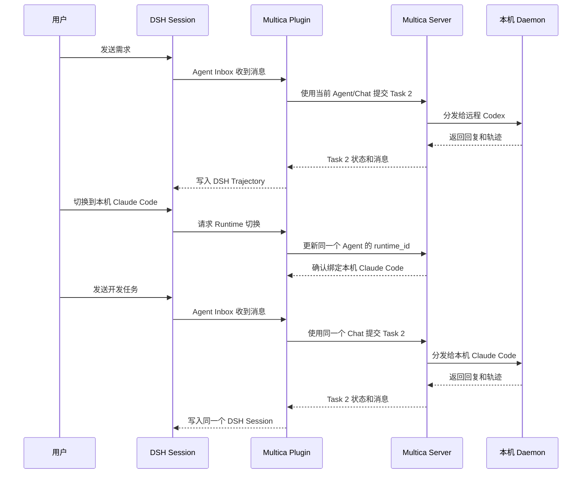

# DSH + Multica 方案说明

## 这套系统要解决什么问题

用户希望像使用一个普通聊天窗口一样工作：

2. 先在远程机器上和 Codex 聊需求、整理文档。
2. 聊到可以开发时，切换到本机的 Codex 或 Claude Code。
3. 开发完成后，还能切回远程 Runtime 继续聊天。
4. 切换过程中仍然是同一个 DSH 会话，上下文和执行轨迹可以继续追踪。
5. DSH 中登记的 Skill 可以送到实际执行任务的 Codex 或 Claude Code。

这套方案把“平台管理”和“代码执行”分开：

> DSH 管理用户看到的会话和平台能力，Multica 管理真正的执行任务，Daemon 连接机器，Codex/Claude Code 负责调用模型和操作文件。

## 先分清四类东西

架构图里的方框不是同一种组件。为了避免混淆，本文把它们分成四类：

| 分类 | 含义 | 本项目例子 |
|---|---|---|
| **接口/数据模型** | 规定对象应该长什么样、有哪些行为 | DSH `Session`、DSH `Agent`、`SessionEvent` |
| **服务（Service）** | DSH 通过 `ctx` 提供给插件使用的能力 | `ctx.sessions`、`ctx.agents`、`ctx.sessionPersistence` |
| **Plugin / 插件** | 被 DSH Loader 加载的扩展模块，提供或组合服务 | 官方 `dsh-agent-loop`、`session-persistence-jsonl`、本项目 `mvp-multica-loop` |
| **业务适配模块** | 插件内部调用的业务代码，不一定是 DSH Plugin | `TaskOrchestrator`、`DshTrajectoryWriter`、`SkillDistributor` |
| **外部进程** | 不运行在 DSH `ctx` 内的独立程序 | Multica Server、Multica Daemon、Codex CLI、Claude Code CLI |

最容易混淆的三个词可以这样记：

```text
Session       = 一份会话记录
ctx.sessions  = 管理会话记录的 DSH 服务
Session Plugin= 装载/扩展会话能力的 DSH 插件

Agent         = 一个执行助手
ctx.agents    = 管理 Agent 的 DSH 服务
Agent Loop    = 驱动 Agent 执行的插件实现
```

因此，图中的“Session”是 DSH 服务/数据模型；“Agent Loop Plugin”才是插件。当前唯一负责替换 Agent Loop 的 DSH 插件是 `mvp-multica-loop`；图中它右侧的 `Task Orchestrator`、`Trajectory Writer` 和 `Skill Distributor` 都只是这个插件内部的代码模块，不是三个额外插件，也不是 DSH 基础服务。

## 先用一个例子理解

假设用户打开一个 DSH 会话，先选择“远程 Codex”：

```text
用户：请帮我梳理这个项目的需求
DSH：保存这条消息，并交给远程 Codex 执行
Multica：创建一个任务，分发给远程 Daemon
Daemon：启动 Codex CLI
Codex：返回需求分析结果
```

用户继续说：

```text
用户：需求已经清楚了，切换到我本机的 Claude Code 开始开发
```

系统会做以下事情：

2. 确认当前任务已经完成，没有正在执行的任务。
2. 找到本机 Daemon 注册的 Claude Code Runtime。
3. 让同一个 Multica Agent 改绑到本机 Claude Code。
4. 继续使用同一个 Multica Chat Session。
5. 把新的 prompt 交给 Claude Code。

这里会产生一个新的 Multica Task，但不会重新创建 DSH 会话、Multica Agent 或 Chat Session。

## 一张图看懂整体架构


如果你要追踪“一条消息具体经过哪个模块、哪个模块真正请求 Multica”，请看 [模块级数据流](architecture-overview.md#22-模块级数据流谁请求-multica如何请求) 和配套图：


上面的总图是六层的“部署与控制流视图”：Runtime 层把 Daemon 和 CLI 放在一起，底部单独画结果回流。为了便于初学者理解，下面再把同一架构拆成八个逻辑层，内容没有增加新的系统组件。

如果需要看 Profile 的完整 JSON、DSH Loader 的消费顺序，以及 `mvp-multica-loop` 如何实现 `AgentFactory` 和执行循环，请直接看 [架构总览中的 Profile 与插件伪代码](architecture-overview.md#32-profile-定义长什么)。

## 分层架构

### 第一层：用户入口

用户看到的是 DSH Web 页面，也可以由飞书 Bot Webhook、其他 API/SDK 等入口调用 Gateway。当前 MVP 已实现浏览器/HTTP 入口；图中的飞书和其他入口是后续可插拔的适配位置。

用户在这里完成：

- 创建和选择会话。
- 发送消息。
- 选择 Codex、Claude Code 和具体机器。
- 查看回复、工具调用和执行状态。
- 使用已经授权的 Skill。

用户不需要了解 Daemon、Task ID 或 CLI 进程。

### 第二层：Gateway

Gateway 是入口处的“前台”。它负责：

- 验证请求身份。
- 执行用户、workspace 和 Runtime 的权限校验。
- 固定用户和 workspace，避免请求伪造用户。
- 按请求类型分发到会话创建、消息发送、取消、Runtime 切换和状态查询。
- 把创建会话、发送消息、取消和 Runtime 切换交给 DSH 官方接口。
- 把 DSH 的流式事件转给浏览器或调用方。

Gateway 不负责调用 Codex，也不直接操作数据库，更不自己实现任务队列。

当前 Gateway 运行在 Windows，默认端口为 `3380`；DSH Web 默认端口为 `3080`。

这里有两个容易混淆的词：`MVP Gateway` 是本项目独立的请求入口，负责鉴权、权限校验、请求分发和状态/轨迹转发；DSH 的 `Web / Connection / UI` 是 DSH Host 内的官方 Web、连接认证和 UI 扩展服务。MVP Gateway 会调用 DSH 的 `SessionController`、`AgentFactory` 等接口，但它不是 DSH 官方 Web 服务的另一个名字。

### DSH Profile：启动时的组装配置

Profile 是 DSH 启动时读取的组合配置，不是一个常驻执行服务。它决定本次 DSH Host 加载哪些官方 Plugin、用户自定义 Plugin，以及是否用 `mvp-multica-loop` 替换默认 Agent Loop。Skill 不直接等同于 Plugin：Skill 由 DSH Skill Registry 管理，再由 `Skill Distributor` 显式同步给 Multica 和目标 CLI。

### 第三层：DSH 平台基座（服务集合，不是一个单独 Plugin）

DSH 是整个应用的“操作系统和平台底座”。它提供：

- Session：保存会话和事件。
- AgentRegistry：管理当前有哪些 Agent。
- AgentFactory：规定 Agent 如何创建和恢复。
- Session Persistence：把会话写入 JSONL 等持久化后端。
- Session Projection：从原始事件计算 turn、step、消息等状态。
- Skill、Tool、MCP、权限和 UI 插件机制。
- Web、Gateway、审批、文件和轨迹扩展点。

DSH 负责平台生命周期，但不一定负责真正调用模型。当前 MVP 关闭了 DSH 默认的模型 Agent Loop，把执行入口交给 Multica 插件。

### 第四层：DSH Multica Runtime Plugin（真正的 DSH Plugin）

这是本项目自研的“转接头”，位于 DSH Host 内。`mvp-multica-loop` 是当前负责替换 Agent Loop 的 DSH Plugin；它把：

```text
DSH Agent 的一轮消息
        ↓
Multica Task
        ↓
Multica 返回的执行事件
        ↓
DSH Trajectory 事件
```

插件内部的 `Task Orchestrator`、`Trajectory Writer`、`Skill Distributor` 分别负责任务编排、轨迹适配和 Skill 分发，它们通过插件内部调用协作，不需要单独注册为 DSH Plugin。

它主要做五件事：

2. 实现 DSH 要求的 `AgentFactory`。
2. 实现一个遵守 DSH 生命周期的 `MulticaAgent`。
3. 把 DSH 的当前 prompt 提交给 Multica。
4. 把 Multica 的文本、工具调用、工具结果和状态写回 DSH。
5. 管理 Runtime 选择、Skill 同步和 Gateway 路由。

它不替换 DSH Session 服务，也不重复实现 Multica 的 Daemon、队列、CLI 循环和 Chat 历史。

### 第五层：Multica Server

Multica Server 是“执行调度中心”。它知道：

- 哪些 Agent 存在。
- 每个 Agent 使用哪个 Runtime。
- 哪些 Project 和工作目录可用。
- 每个 Chat Session 的执行历史。
- 哪些 Task 正在排队、执行、完成或失败。
- 哪些 Daemon 在线，以及它们有哪些 CLI Runtime。

当前 DSH Plugin 通过 Multica 官方 API 调用它，不修改 Multica 源码。

### 第六层：Multica Daemon

Daemon 是安装在某台机器上的“执行连接器”。它负责：

- 向 Multica Server 注册自己。
- 定期发送心跳。
- 领取 Multica Task。
- 在本机启动 Codex CLI 或 Claude Code CLI。
- 把执行状态、工具事件和最终回复上报给 Multica。

当前方案支持两类 Daemon：

- Daytona Sandbox 中的远程 Daemon。
- Windows 本机运行的本地 Daemon。

控制面服务（DSH、Gateway、Multica Server）当前运行在 Windows Host；远程 Daemon 和 CLI 运行在 Daytona Sandbox 内，本机 Daemon 和 CLI 运行在 Windows 宿主机进程中，不属于 Daytona 沙箱。

### 第七层：Codex CLI / Claude Code CLI

这两个 CLI 才是实际执行代码和调用模型的程序。

它们使用各自的官方配置：

- Codex 使用自己的 `CODEX_HOME`、模型和 API 配置。
- Claude Code 使用自己的配置目录、模型和 Anthropic 兼容 API 配置。
- Multica 不替代 CLI 的模型调用逻辑。

当前配置使用 DeepSeek Flash，但模型请求仍由 CLI 自己发起。

### 第八层：数据与轨迹

系统中有几类数据：

- DSH JSONL：平台会话和 DSH 原生事件。
- SQLite：DSH Session、Multica Agent、Chat Session、Task、Runtime 和 Sandbox 的关联关系。
- Multica 数据库：Multica 自己的 Agent、Project、Chat、Task 和 Runtime 数据。
- Daemon 轨迹：CLI 的文本、工具调用和结果。

DSH Trajectory Writer 将 Multica 的真实执行事实转换为 DSH 可以展示和持久化的事件。

## 关键概念的区别

### Session：用户看到的聊天会话

Session 是 DSH 层的概念。用户打开的一个聊天窗口就是一个 DSH Session。

它保存：

- 用户消息。
- Agent 回复。
- 工具调用和结果。
- turn/step 边界。
- Runtime 和执行环境关联。

### Agent：一个稳定的执行身份

Agent 可以理解为“这个会话长期使用的执行助手”。在当前方案中，一个 DSH Session 通常对应一个稳定的 Multica Agent。

Agent 可以更换 Runtime，但身份不变：

```text
Agent A2
  之前绑定：远程 Codex
  后来绑定：本机 Claude Code
  再后来绑定：远程 Codex
```

### Chat Session：Multica 保存的执行上下文

Chat Session 是 Multica 层的上下文容器。它让 Multica 知道同一个 Agent 之前聊过什么，并负责不同 CLI provider 的会话恢复或重新建立。

DSH 不再自己拼一份完整历史发给 CLI，而是只提交当前用户 prompt。

### Task：一次具体执行

每次用户发送一个新的要求，Multica 通常会创建一个新的 Task：

```text
一个 DSH Session
  └── 一个稳定 Multica Agent
       └── 一个稳定 Chat Session
            ├── Task 2：分析需求
            ├── Task 2：生成代码
            └── Task 3：运行测试
```

Task 是一次执行记录，不等于用户看到的会话。

### Chat 与 Work/Issue 不是一回事

在 Multica 官方概念里，**Chat** 是不依附看板任务的私人对话；**Work/Issue** 是有标题、负责人、状态、优先级和团队协作记录的正式工作项。当前 MVP 使用 Chat API：

```text
POST /api/chat/sessions/{chatSessionId}/messages
        ↓
Multica 为本条 Chat 消息创建内部 Task/Run
```

因此现在的简单问答、需求讨论和临时小修改已经走 Chat。看到 Task ID 只代表这条消息的一次执行记录，不代表系统创建了一个正式 Issue。`in_place` 和 `worktree` 则是目录执行方式，和 Chat/Issue 属于不同概念。

### Runtime：一个具体的执行目标

Runtime 不是单纯的模型名称，而是一个具体的“机器 + Daemon + CLI”：

```text
remote-codex  = 远程 Daemon + Codex CLI
remote-claude = 远程 Daemon + Claude Code CLI
local-codex   = 本机 Daemon + Codex CLI
```

切换 Runtime 就是让同一个 Agent 改绑到另一个 Runtime。

### Daemon：某台机器上的执行代理

Daemon 连接 Multica Server 和具体机器。它不是 DSH Agent，也不是用户会话；一台机器可以有一个 Daemon，并注册多个 Runtime。

### Project / WorkDir：任务工作目录

Multica Project 描述任务应该在哪个目录执行。当前 MVP 在切换同一 Daemon 上的 Runtime 时保持工作目录不变；切换到另一台机器时，必须确保目标机器有对应目录。

### Skill：可复用的工作说明

Skill 是一份给执行 Agent 使用的说明书，例如：

```text
当用户要求把普通中文改成二次元台词时：
2. 保留事实和任务顺序。
2. 只调整表达语气。
3. 输出改写结果和语气说明。
```

当前流程是：

```text
DSH Skill
  → Multica Skill API
  → 绑定到 Multica Agent
  → 目标 Daemon
  → Codex / Claude Code
```

### Trajectory：可追踪的执行轨迹

Trajectory 是任务执行的“审计记录”，包括：

- 回复文本。
- 工具调用。
- 工具结果。
- 任务状态。
- turn/step。
- Runtime 和 Task 关联。
- 未知或无法解释的原始事件。

DSH 负责统一展示和持久化，Multica 负责提供真实执行事实。

## 同一会话切换 Runtime 的完整过程



切换前必须满足：当前会话没有未完成任务。这样可以避免两个 CLI 同时修改同一个 Agent 的状态。

## Multica Plugin 的实际实现

当前插件入口是 [multica-plugin.ts](../apps/dsh-host/multica-plugin.ts)。DSH Profile 先关闭默认 `agent-loop`，再插入 `mvp-multica-loop`：

```text
关闭 DSH 默认 Agent Loop
        ↓
加载 mvp-multica-loop
        ↓
调用 createDriver({ ctx })
        ↓
ctx.agents.setFactory(...)
```

这里的“实现插件”有三个层次，不能合并理解：

2. **Plugin 入口**：`apply(ctx)`，负责装配依赖、创建 Driver、注册路由和注册 Factory。
2. **AgentFactory**：实现 `createAgent()` 和 `resume()`，告诉 DSH 如何创建/恢复一个 Agent。
3. **Agent Loop**：实现 `MulticaAgent` 的消息接收、Inbox、turn/step、取消、空闲和销毁，然后在合适的位置调用 Multica。

`ctx.agents.setFactory()` 只注册第二层 Factory；真正执行第三层循环的是 `MulticaAgent`。Session 服务本身没有被替换。

插件从 DSH 获取这些核心服务：

| DSH 服务 | 插件用途 |
|---|---|
| `ctx.agents` | 注册自定义 AgentFactory |
| `ctx.sessions` | 创建、追加和 flush Session 事件 |
| `ctx.sessionPersistence` | 恢复已有 JSONL Session |
| `ctx.sessionProjections` | 读取 turn/step 和 Inbox 状态 |
| `ctx.skills` | 读取官方 DSH Skill Registry |
| `ctx.sessionController` | 接入 DSH Web 的会话命令 |
| `ctx.webServer` | 注册 Runtime 选择路由 |
| `ctx.connection` | 使用官方认证和错误响应 |

插件本身主要实现两个 DSH 接口：

```ts
interface AgentFactory {
  createAgent(ownerCtx, options): Promise<AgentHandle>;
  resume(ownerCtx, options): Promise<AgentHandle>;
}

interface Agent {
  send(message, target, wakeup): void;
  followup(message): void;
  steer(message): void;
  inject(message): void;
  cancel(cause, options?): void;
  whenIdle(): Promise<void>;
  runMaintenance(task): Promise<unknown>;
}
```

`MulticaAgent` 负责遵守 DSH Agent 生命周期，`TaskOrchestrator` 负责调用 Multica 官方 API，二者分工如下：

```text
MulticaAgent
  = DSH Agent 生命周期、Inbox、turn/step、取消、恢复

TaskOrchestrator
  = Runtime 选择、资源关联、提交 Task、状态轮询、轨迹同步

Multica Server / Daemon
  = 队列、Daemon、CLI、执行状态、Provider 上下文
```

## `ctx` 到底是什么

`ctx` 是 DSH/Cordis 的上下文对象，可以理解为“插件插座板”：

- DSH 把服务安装到 `ctx` 上。
- 插件声明自己需要哪些服务。
- DSH 只有在依赖准备好后才运行插件。
- 插件通过 `ctx.effect()` 注册资源清理。
- Agent 还可以拥有自己的子作用域 `agent.ctx`。

`ctx` 不是用户的聊天内容，也不是 Multica 的 Chat Session。它是插件访问 DSH 平台能力的入口。

## 如何自定义插件

DSH 插件通常是一个 TypeScript/JavaScript 模块：

```ts
export const name = 'my-session-observer';
export const inject = ['sessions'];

export function apply(ctx) {
  const dispose = ctx.on('session/event', (_session, event) => {
    console.log(event.type);
  });

  ctx.effect(() => dispose);
}
```

然后在 Profile 中加载：

```js
{
  id: 'my-session-observer',
  name: './my-session-observer.ts',
  config: {}
}
```

常见插件类型：

| 类型 | 例子 |
|---|---|
| Runtime/Agent Plugin | Multica Runtime、另一个外部 Agent |
| Skill Plugin | 文件 Skill、远程 Skill、企业知识 Skill |
| Tool/MCP Plugin | Jira、GitHub、数据库、内部 API |
| Session/Persistence Plugin | JSONL、SQLite、远程存储 |
| Gateway/API Plugin | HTTP、RPC、SSE、飞书接入 |
| UI Plugin | Runtime 下拉框、设置页、轨迹展示 |
| Sandbox/Process Plugin | Daytona、Shell、文件和进程 |
| Policy/Approval Plugin | 权限、审批、凭据隔离 |
| Observability Plugin | Trajectory、OTel、评测和审计 |

插件是否能使用某项能力，取决于对应 DSH 服务是否装载并注入。安装一个 DSH Plugin，不代表 Codex 和 Claude Code 自动拥有该插件的全部能力；需要为目标 Runtime 做明确适配。

## 当前部署位置

当前 MVP 的实际部署关系是：

```text
Windows
  ├─ DSH Web
  ├─ MVP Gateway
  ├─ DSH Multica Plugin
  ├─ Multica Server
  └─ 本机 Multica Daemon（可选）

Ubuntu / Daytona
  ├─ PostgreSQL、Daytona 等基础服务
  └─ Daytona Sandbox 内的 Multica Daemon
       ├─ Codex CLI
       └─ Claude Code CLI
```

当前代码已经提供多租户控制面：每个用户有独立 Profile、Sandbox、默认 Daemon 和按需 DSH Host；同一用户可以有多个 DSH Session 并行，每个 Session 有独立任务关联和工作目录，受到用户 Profile 与 Daemon 并发额度限制。

Gateway 作为共享入口，先认证用户，再校验 user/workspace/Runtime/Plugin/Skill 权限，随后按 `userId + sessionId` 路由流量。Profile Composer 将系统基线 Profile、用户自定义 Plugin manifest 和系统 Skill catalog 组装成用户域的 Effective Profile；DSH Loader 在对应 DSH Host 启动时消费一次。任意用户自定义 Plugin 需要用户域隔离，不能在共享 Host 中按每条请求热改全局 Profile。HostSupervisor 按需为用户启动一个 Host，空闲后停止；同一用户的多个 Session 复用该 Host，不同用户不共享 Host/Sandbox。

## 当前已经实现和验证的内容

- DSH 官方 AgentFactory/Agent Loop 适配。
- DSH Session 与 Multica Agent/Project/Chat Session 关联。
- Codex ↔ Claude Code Runtime 切换。
- 远程 Daemon 与 Windows 本机 Daemon 注册和选择。
- Multica Task 状态、取消和轨迹回传。
- DSH JSONL 和 SQLite 持久化关联。
- DSH Managed Skill 同步到 Multica。
- 二次元语句转换 Skill 的真实 Codex/Claude Code 调用。
- Codex → Claude Code 的同会话真实切换测试。
- 132 项自动化测试和 TypeScript 类型检查通过；多租户部分目前是本地控制面验证，真实 100 用户压力验收仍需在部署环境执行。

真实验收结果保存在 [acceptance-results.md](acceptance-results.md)，可操作命令见 [try-mvp.md](try-mvp.md)。

## 当前边界

- 用户登录可接入 `identityProviderModule`，默认也支持用户 Token；管理员需通过 DSH Hub/运维接口管理。生产环境仍需完成 100 用户的实际部署、压测和灾备验收。
- 不自动上传或同步用户项目代码目录；跨机器执行前，目标机器必须已有可用工作目录。
- DSH 的 Skill 可以显式同步给 Multica；普通 DSH Tool、MCP、Memory 和 UI 能力需要分别适配。
- CubeSandbox/PVM 尚未作为当前执行节点，当前使用 Daytona。
- 长时间断网时，终态报告的上游持久化能力仍需单独增强。

## 一句话总结

DSH 是用户和平台看到的“工作台”，`ctx.sessions` 是会话服务，Agent Loop Plugin 是执行循环实现；Multica 是负责派活的“调度中心”，Daemon 是连接具体机器的“执行代理”，Codex/Claude Code 是真正干活的“执行程序”。Multica Runtime Plugin 只负责把 DSH Agent Loop 接到 Multica，同时让 DSH 保留统一会话和轨迹。


